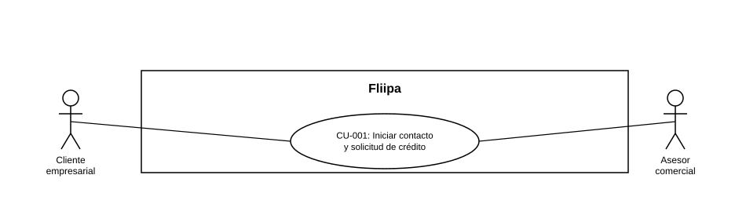

### CU-001: Iniciar contacto y solicitud de crédito

| Campo | Detalle |
|---|---|
| **Actores** | Cliente empresarial (principal); Asesor comercial (secundario) |
| **Descripción** | Un cliente preaprobado es contactado por el asesor comercial por varios canales y recibe un enlace único para iniciar (o retomar) su proceso de solicitud de crédito, con acompañamiento comercial durante todo el proceso. |
| **Precondiciones** | El cliente está en la base de clientes preaprobados. El asesor cuenta con las plantillas de contacto para correo, WhatsApp y llamada. |
| **Flujo principal** | 1. El asesor comercial contacta simultáneamente al cliente por correo, WhatsApp y llamada. 2. El cliente recibe por WhatsApp un enlace único asociado a su proceso de solicitud. 3. El cliente accede al enlace. 4. El sistema valida el Documento de Identidad del cliente. 5. Si existe una solicitud en estado `REQUEST_STARTED`, el sistema la reutiliza; si no, crea una nueva. 6. El asesor hace seguimiento remoto al cliente durante el proceso, resolviendo dudas o inquietudes. |
| **Flujos alternativos / excepciones** | A1. El cliente ya está registrado previamente: esto no impide su ingreso al proceso. A2. El cliente no responde por ningún canal: el asesor registra la tasa de respuesta por canal para el seguimiento comercial. |
| **Postcondiciones** | El cliente cuenta con una solicitud de crédito activa (nueva o reutilizada) y ha sido contactado por el canal comercial correspondiente. |
| **Reglas de negocio** | El contacto debe intentarse por los tres canales definidos (correo, WhatsApp, llamada). El seguimiento comercial no requiere visitas presenciales. |
| **Historias de usuario relacionadas** | HU-001 (Recibir enlace único de solicitud) HU-019 (Contacto simultáneo multicanal) HU-020 (Acompañar la originación del cliente) |
| **Estado en plataforma** | Enlace único y reutilización de solicitud: implementado (`create-checkout.ts`). Contacto multicanal orquestado: no se encontró herramienta técnica dedicada en el repositorio revisado; probablemente es un proceso manual o soportado por un CRM externo. |
| **Referencias** | Fuente: fichas HU-001, HU-019 y HU-020 — *Historias de Usuario — Fliipa*, carpeta "1. Onboarding" (repositorio `documentacion_fliipa`, María Fernanda Herazo). |

