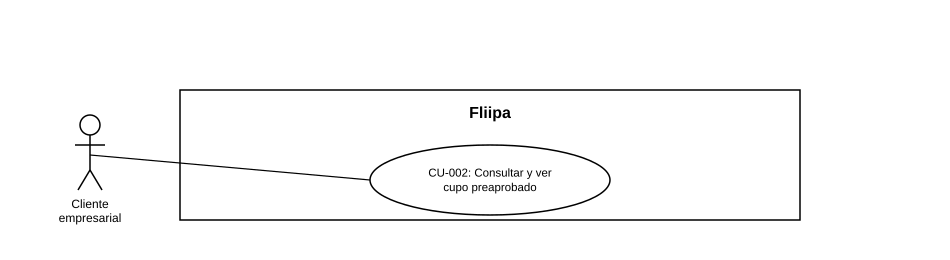

### CU-002: Consultar y ver cupo preaprobado

| Campo | Detalle |
|---|---|
| **Actores** | Cliente empresarial |
| **Descripción** | El cliente ingresa su número de documento para saber si tiene un cupo preaprobado y, de tenerlo, consulta el valor de dicho cupo antes de completar el formulario de solicitud. |
| **Precondiciones** | Existe un archivo o base de clientes preaprobados cargada y procesada por el motor de riesgo. |
| **Flujo principal** | 1. El cliente ingresa únicamente su número de documento (el tipo de documento se resuelve automáticamente contra la base de preaprobados). 2. El sistema consulta si existe una preaprobación asociada al documento. 3. El sistema informa al cliente si puede continuar con el proceso. 4. Si existe preaprobación, el sistema solicita datos adicionales del cliente antes de mostrar el valor del cupo (no lo muestra de golpe apenas se confirma la preaprobación). 5. Una vez recibidos esos datos, el sistema muestra el valor del cupo preaprobado o sugerido. 6. El cliente decide si continúa con el resto del formulario de solicitud. |
| **Flujos alternativos / excepciones** | A1. El documento no tiene preaprobación asociada: el sistema informa al cliente que no puede continuar por esta vía (ver CU-009, mensaje de no disponibilidad). |
| **Postcondiciones** | El cliente conoce si cuenta con preaprobación y, tras suministrar los datos solicitados, el valor de su cupo, antes de invertir tiempo en completar todo el formulario. |
| **Reglas de negocio** | El valor mostrado corresponde al cupo disponible según la información de preaprobación cargada y procesada por la plataforma. El sistema no puede resolver el tipo de documento por sí solo con el número; corresponde al tipo/número cargado en la base preaprobada. El valor del cupo solo se muestra después de solicitar  datos adicionales al cliente, no inmediatamente tras confirmar la preaprobación. |
| **Historias de usuario relacionadas** | [HU-001](../../Historias De Usuario/1. Onboarding/HU-001 Recibir enlace ˙nico de solicitud.md) (Recibir enlace √∫nico) [HU-002](../../Historias De Usuario/1. Onboarding/HU-002 Consultar si tengo cupo preaprobado con mi n˙mero de documento.md) (Consultar si tengo cupo preaprobado) [HU-003](../../Historias De Usuario/1. Onboarding/HU-003 Ver cupo preaprobado antes de completar el formulario.md) (Ver cupo preaprobado antes de completar el formulario) |
| **Estado en plataforma** | Implementado y operativo en el motor de riesgo (`b2b-base-preapproval.ts`, `get-suggested-credit.ts`). |
| **Referencias** | Fuente: fichas [HU-001](../../Historias De Usuario/1. Onboarding/HU-001 Recibir enlace ˙nico de solicitud.md), [HU-002](../../Historias De Usuario/1. Onboarding/HU-002 Consultar si tengo cupo preaprobado con mi n˙mero de documento.md) y [HU-003](../../Historias De Usuario/1. Onboarding/HU-003 Ver cupo preaprobado antes de completar el formulario.md) ‚Äî *Historias de Usuario ‚Äî Fliipa*, carpeta "1. Onboarding" (repositorio `documentacion_fliipa`, Mar√≠a Fernanda Herazo). |
