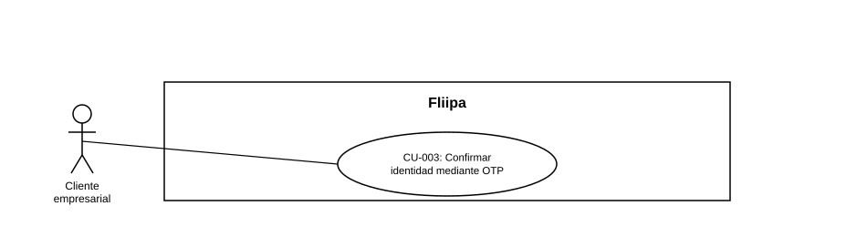

### CU-003: Confirmar identidad mediante OTP

| Campo | Detalle |
|---|---|
| **Actores** | Cliente empresarial |
| **Descripción** | El cliente valida su identidad ingresando de forma secuencial los códigos OTP enviados por WhatsApp y por correo electrónico, con posibilidad de reintentar el envío o corregir sus datos de contacto si el código no llega. |
| **Precondiciones** | El cliente ya inició o retomó su solicitud (CU-001) y llegó al paso de validación de identidad. |
| **Flujo principal** | 1. El cliente ingresa su número de teléfono. 2. El sistema envía un código OTP al número registrado mediante WhatsApp. 3. El cliente ingresa el código OTP recibido. 4. El sistema valida el código ingresado. 5. El cliente ingresa su correo electrónico. 6. El sistema envía un segundo código OTP al correo electrónico registrado. 7. El cliente ingresa el código OTP recibido. 8. El sistema valida el código y, si es correcto, permite al cliente continuar con el siguiente paso del proceso. |
| **Flujos alternativos / excepciones** | A1. El código no llega: el cliente solicita el reenvío respetando el tiempo de espera definido entre envíos. A2. El teléfono o correo fue ingresado incorrectamente: el cliente regresa al paso anterior, corrige el dato y solicita un nuevo código sin reiniciar la solicitud completa. A3. La validación del código falla: el sistema muestra un mensaje genérico, sin revelar información sensible. |
| **Postcondiciones** | La identidad del cliente queda validada por ambos canales y puede continuar con el proceso de KYC. |
| **Reglas de negocio** | Los dos códigos (WhatsApp y correo) deben validarse secuencialmente antes de avanzar. El nuevo código, tras una corrección de datos, se envía al dato de contacto ya corregido. |
| **Historias de usuario relacionadas** |[HU-004](../../Historias%20De%20Usuario/1.%20Onboarding/HU-004%20Confirmar%20identidad.md) (Confirmar identidad) [HU-005](../../Historias%20De%20Usuario/1.%20Onboarding/HU-005%20Reintentar%20o%20corregir%20el%20env%C3%ADo%20del%20OTP.md) (Reintentar o corregir el envío del OTP) |
| **Estado en plataforma** | Implementado (`send-otp.ts`, `validate-otp.ts`). **Hallazgos de seguridad vigentes**: existe un código comodín hardcodeado que valida cualquier OTP ([RNF-001](../../Requerimientos/Requerimientos%20No%20Funcionales.md)), y el canal SMS está simulado — no envía mensajes reales ([RNF-007](../../Requerimientos/Requerimientos%20No%20Funcionales.md)). Ambos deben priorizarse antes de producción. | |
| **Referencias** | Fuente: fichas [HU-004](../../Historias%20De%20Usuario/1.%20Onboarding/HU-004%20Confirmar%20identidad.md) (Confirmar identidad),[HU-005](../../Historias%20De%20Usuario/1.%20Onboarding/HU-005%20Reintentar%20o%20corregir%20el%20env%C3%ADo%20del%20OTP.md) (Reintentar o corregir el envío del OTP — *Historias de Usuario — Fliipa*, carpeta "1. Onboarding" (repositorio `documentacion_fliipa`, María Fernanda Herazo). |
