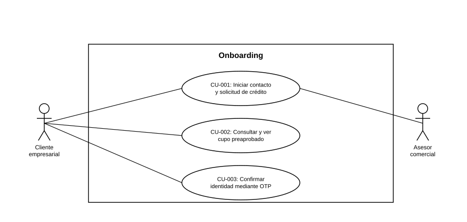

# Diagrama de Casos de Uso — Onboarding

**Actores del capítulo:** Cliente empresarial, Asesor comercial

**Casos de uso incluidos:**

- [CU-001](CU-001 Iniciar contacto y solicitud de credito.md)
- [CU-002](CU-002 Consultar y ver cupo preaprobado.md)
- [CU-003](CU-003 Confirmar identidad mediante OTP.md)

> Diagrama UML de casos de uso generado a partir de las fichas de este capítulo (ver `README.md` del proyecto para la tabla de correspondencia Historias de Usuario → Casos de Uso).
