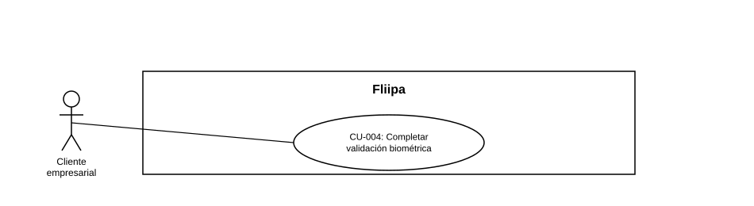

### CU-004: Completar validación biométrica

| Campo | Detalle |
|---|---|
| **Actores** | Cliente empresarial |
| **Descripción** |  Diseño previsto: el cliente completaría el proceso de biometría con un proveedor externo, desde cualquier dispositivo disponible, para verificar su identidad sin acudir a una oficina física. Hoy este proceso no está implementado en el código revisado. |
| **Precondiciones** | El cliente ya validó su identidad mediante OTP (CU-003). No implica que exista biometría disponible a continuación (ver Estado en plataforma). |
| **Flujo principal** |  1. El sistema presentaría al cliente el paso de validación biométrica. 2. El cliente completaría el proceso de biometría con el proveedor externo, desde el dispositivo disponible (celular, computador u otro). 3. El proveedor externo procesaría la validación. 4. El sistema registraría el resultado (aprobado, rechazado o en revisión) asociado a la solicitud. |
| **Flujos alternativos / excepciones** | A1. (Diseño) Si el resultado quedara "en revisión", el caso pasaría a revisión manual del analista de riesgo (ver CU-005, también pendiente / no disponible hoy). |
| **Postcondiciones** | (Diseño) La solicitud del cliente quedaría con un resultado biométrico (aprobado, rechazado o en revisión) registrado. Hoy no aplica porque el CU no está disponible en la plataforma. |
| **Reglas de negocio** | (Diseño) El proceso no debería limitarse a un flujo exclusivamente móvil; el cliente podría usar cualquier dispositivo disponible. Esta regla no puede validarse hoy porque el CU no está implementado. |
| **Historias de usuario relacionadas** | [HU-006](../../Historias%20De%20Usuario/1.%20Onboarding/HU-006%20Completar%20la%20validaci%C3%B3n%20biom%C3%A9trica%20%28KYC%29.md) (Completar la validación biométrica) |
| **Estado en plataforma** | No disponible / pendiente. En el monorepo completo (no solo `b2b/`), la integración con el proveedor de biometría (OlimpiaIT) aparece en backlog, sin implementación vigente; los pasos de captura de foto/selfie que existían en el flujo quedaron deprecados. No se debe asumir que "vive en otro microservicio" fuera de este monorepo: con esta evidencia ampliada, se documenta como "no está implementado hoy", a la espera de que negocio confirme el alcance y el momento de esta integración. |
| **Nota de organización** | HU-006 (su historia de usuario de origen) está ubicada en la carpeta "1. Onboarding", no en "2. KYC". Siguiendo la metodología de este catálogo ("se conservó la carpeta y el capítulo de cada HU de origen"), este CU-004 debería vivir en `1. Onboarding/`. Se deja documentada aquí la inconsistencia; la reubicación física del archivo (y su diagrama) queda pendiente de una pasada de reorganización que no rompa las referencias cruzadas de este capítulo (CU-005, CU-019, diagrama consolidado del capítulo). |
| **Referencias** | Fuente: ficha [HU-006](../../Historias%20De%20Usuario/1.%20Onboarding/HU-006%20Completar%20la%20validaci%C3%B3n%20biom%C3%A9trica%20%28KYC%29.md) (Completar la validación biométrica) — *Historias de Usuario — Fliipa*, carpeta "1. Onboarding" (repositorio `documentacion_fliipa`, María Fernanda Herazo). |
