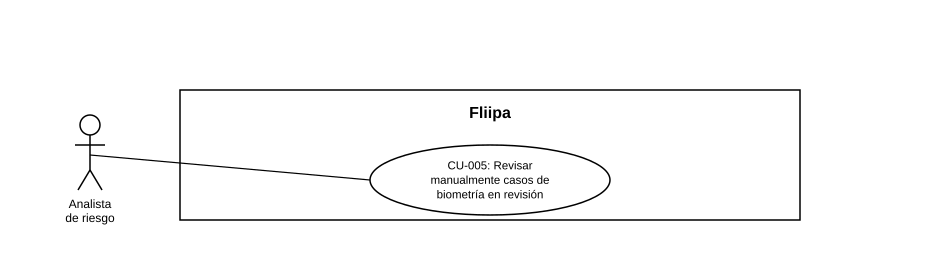

### CU-005: Revisar manualmente casos de biometría en revisión

| Campo | Detalle |
|:---:|:---:|
| **Actores** | Analista de riesgo |
| **Descripción** | El analista de riesgo revisa manualmente los casos de biometría marcados "en revisión" para decidir si el cliente puede continuar el proceso de solicitud. |
| **Precondiciones** | Existe al menos un caso con resultado biométrico "en revisión" (ver CU-004). |
| **Flujo principal** | 1. El analista consulta el listado de casos "en revisión". 2. El analista revisa la información biométrica del caso. 3. El analista registra su decisión: continuar o rechazar. 4. El sistema actualiza el estado de la solicitud según la decisión registrada. |
| **Flujos alternativos / excepciones** | A1. El analista no cuenta con información suficiente: puede dejar el caso pendiente hasta obtener más contexto (no verificado en código). |
| **Postcondiciones** | El caso biométrico deja de estar "en revisión" y queda con una decisión explícita (continuar o rechazar). |
| **Reglas de negocio** | Todo caso "en revisión" requiere una decisión manual explícita del analista antes de continuar el flujo del cliente. |
| **Historias de usuario relacionadas** | HU-022 (Resolver manualmente casos de biometría en revisión) |
| **Estado en plataforma** | No se encontró en el código ningún estado de "en revisión" para biometría, ni cola o pantalla de revisión manual (búsqueda de "en_revision", "manual_review", "under_review" sin coincidencias). Sin respaldo verificable en el código fuente entregado. |
| **Referencias** | Fuente: ficha HU-022 — *Historias de Usuario — Fliipa*, carpeta "2. KYC" (repositorio `documentacion_fliipa`, María Fernanda Herazo). |
