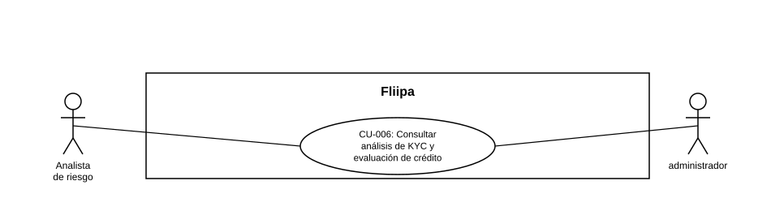

### CU-006: Consultar análisis de KYC y evaluación de crédito

| Campo | Detalle |
|---|---|
| **Actores** | Analista de riesgo; administrador (secundario, para HU-038/039) |
| **Descripción** | El analista consulta, para un cliente dado, el resultado de Experian (Reconocer y Advance Score), el histórico transaccional de D1 y el score calculado, incluyendo si los datos de contacto del cliente coinciden con lo reportado en Reconocer, para validar o ajustar la decisión de crédito. |
| **Precondiciones** | El cliente cuenta con una solicitud en evaluación y con información consultable en centrales. |
| **Flujo principal** | 1. El analista abre la ficha del cliente. 2. El analista consulta el resultado de Experian (Reconocer y Advance Score). 3. El analista consulta el histórico transaccional D1 y el score consolidado. 4. El sistema muestra si los datos de contacto (correo, celulares, direcciones) del cliente o su representante legal coinciden con los reportados en Reconocer, resaltando las coincidencias. 5. El analista aprueba o rechaza la solicitud con base en la información consolidada. |
| **Flujos alternativos / excepciones** | A1. El dato de Fliipa no aparece en centrales: el sistema lo indica explícitamente. A2. No hay dato en Fliipa para comparar: se muestra "sin dato en registro". A3. La sección no trae información de centrales: se muestra sin datos. A4. El analista solicita actualización de un producto de centrales cuando aplique. |
| **Postcondiciones** | El analista cuenta con la información necesaria de centrales, histórico y score para tomar o ajustar la decisión de crédito. |
| **Reglas de negocio** | Esta consulta es asistencia visual al analista; no reemplaza la decisión automática del motor KYC (ver CU-020). |
| **Historias de usuario relacionadas** | HU-023 (Análisis de KYC + evaluación de crédito) HU-038 (Consultar información de centrales) HU-039 (Ver coincidencias entre Fliipa y Reconocer) |
| **Estado en plataforma** | La integración con Experian existe en el microservicio `evaluations`. HU-038 y HU-039 están implementadas (hecho). No se encontró una pantalla o endpoint único que consolide Experian + histórico D1 + score en un solo lugar; cada dato se consulta por endpoints separados. |
| **Referencias** | Fuente: fichas HU-023, HU-038 y HU-039 — *Historias de Usuario — Fliipa*, carpeta "2. KYC" (repositorio `documentacion_fliipa`, María Fernanda Herazo). |
