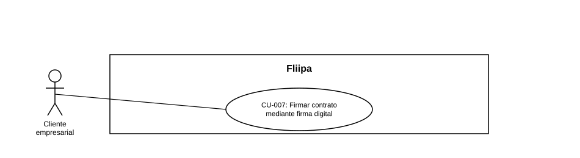

### CU-007: Firmar contrato mediante firma digital

| Campo | Detalle |
|---|---|
| **Actores** | Cliente empresarial |
| **Descripción** | El cliente revisa y firma su contrato mediante el mecanismo de firma digital de un proveedor externo, para activar su cupo de crédito sin necesidad de papeleo físico. |
| **Precondiciones** | La solicitud del cliente fue aprobada y está lista para la generación del contrato. |
| **Flujo principal** | 1. El sistema genera el contrato del cliente. 2. El cliente revisa el contenido del contrato. 3. El cliente firma el contrato a través del mecanismo de firma digital del proveedor externo definido. 4. El sistema genera el PDF firmado. 5. El sistema envía el PDF firmado al correo del cliente. |
| **Flujos alternativos / excepciones** | A1. El cliente no completa la firma: el contrato queda pendiente de firma y el cupo no se activa. |
| **Postcondiciones** | El cliente cuenta con el contrato firmado y su cupo queda activado. |
| **Reglas de negocio** | La firma ya no se realiza mediante código OTP; se realiza exclusivamente mediante el proveedor externo de firma digital vigente. |
| **Historias de usuario relacionadas** | [HU-009](../../Historias%20De%20Usuario/2.%20KYC/HU-009%20Firmar%20contrato%20mediante%20firma%20digital%20con%20proveedor%20externo.md) (Firmar contrato mediante firma digital con proveedor externo) (Firmar contrato mediante firma digital con proveedor externo) |
| **Estado en plataforma** | Implementado (`sign-contract.ts`, `send-contract.controller.ts`). Pendiente confirmar con el equipo técnico el proveedor de firma digital vigente y retirar del código la lógica obsoleta de `send-signature-otp.ts`. |
| **Referencias** | Fuente: ficha [HU-009](../../Historias%20De%20Usuario/2.%20KYC/HU-009%20Firmar%20contrato%20mediante%20firma%20digital%20con%20proveedor%20externo.md) (Firmar contrato mediante firma digital con proveedor externo)— *Historias de Usuario — Fliipa*, carpeta "2. KYC" (repositorio `documentacion_fliipa`, María Fernanda Herazo). |
