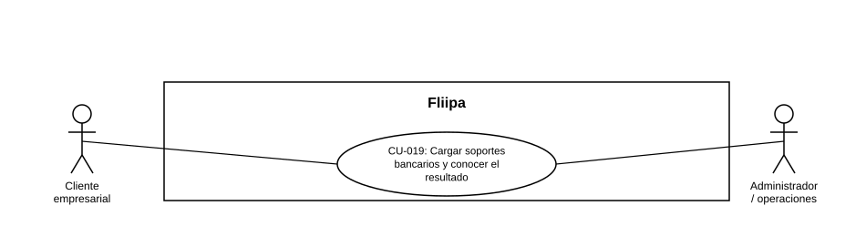

### CU-019: Cargar soportes bancarios y conocer el resultado

> **Nota (actualizada 2026-08-19):** este caso de uso se creó originalmente porque HU-007 y HU-008 no tenían ficha de contenido en el repositorio. En la versión actual (v1.7), ambas fichas ya están completas, pero declaran textualmente `Casos de uso: CU-005` (HU-007) y `Casos de uso: CU-006` (HU-008) — números que en este catálogo corresponden a flujos de un actor distinto (Analista de riesgo, no Cliente empresarial). Se mantiene esta ficha como **CU-019** para no mezclar actores incompatibles bajo un mismo caso de uso, y se deja constancia de la discrepancia en CU-005 y CU-006 para que el equipo de negocio confirme la numeración correcta.

| Campo | Detalle |
|:---:|:---:|
| **Actores** | Cliente empresarial (carga); Administrador / operaciones (consulta) |
| **Descripción** | El cliente carga sus soportes bancarios (certificación y extractos) como parte del proceso de KYC, conoce el resultado de su solicitud en un plazo máximo definido, y el equipo de operaciones puede consultar y abrir esos soportes desde el panel administrativo. |
| **Precondiciones** | El cliente validó su identidad (CU-003) y, según el flujo, completó o está completando la validación biométrica (CU-004). |
| **Flujo principal** | 1. El cliente carga la certificación bancaria y los extractos (2 PDFs) en la plataforma. 2. El sistema confirma de inmediato la recepción y procesa la carga en segundo plano. 3. El cliente recibe el resultado de su solicitud dentro del plazo máximo definido (24 horas). 4. Desde el panel administrativo, el equipo de operaciones (con permiso) consulta si hay certificación y extractos cargados para el cliente y abre cada PDF. |
| **Flujos alternativos / excepciones** | A1. Falta alguno de los soportes: el panel administrativo lo indica explícitamente. A2. El usuario del panel no tiene permiso: no puede ver los soportes. |
| **Postcondiciones** | Los soportes bancarios del cliente quedan cargados y disponibles para consulta en el panel, y el cliente conoce el resultado de su solicitud dentro del SLA definido. |
| **Reglas de negocio** | El SLA de resultado de la solicitud es de máximo 24 horas. Solo usuarios con permiso pueden ver los soportes bancarios en el panel. |
| **Historias de usuario relacionadas** | HU-007 (Cargar soportes bancarios), HU-008 (Conocer el resultado en máximo 24 horas), HU-037 (Ver y abrir soportes bancarios en el panel) |
| **Estado en plataforma** | HU-037 (consulta en panel): implementado (hecho). HU-007 y HU-008: sus fichas de origen en el repositorio de Historias de Usuario están vacías (sin contenido cargado); esta ficha de caso de uso se construyó a partir de las referencias cruzadas que otras historias (HU-006, HU-011, HU-037) hacen sobre ellas. Se recomienda completar el contenido de HU-007 y HU-008 en el documento fuente. |
| **Referencias** | Fuente: ficha HU-037 y referencias cruzadas en HU-006, HU-011, HU-030 y README — *Historias de Usuario — Fliipa*, carpetas "1. Onboarding" y "2. KYC" (repositorio `documentacion_fliipa`, María Fernanda Herazo). |
