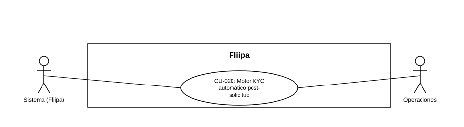

### CU-020: Motor KYC automático post-solicitud

| Campo | Detalle |
|---|---|
| **Actores** | Sistema (Fliipa); Administrador / operaciones (cierre y reevaluación manual) |
| **Descripción** | *(Diseño previsto, no vigente hoy en `credits-platform-main` — ver Estado en plataforma.)* El diseño contempla que, al quedar una solicitud en estado `REQUESTED`, el sistema dispararía automáticamente una evaluación KYC que correría cuatro reglas duras, guardaría el resultado de cada una y aplicaría la decisión final (aprobado o pre-rechazado) al crédito, avisando al cliente solo cuando la decisión es definitiva. Hoy el crédito llega a `REQUESTED` y ahí se queda: no hay ningún proceso automático que lo mueva a `approved` o `pre_rejected`. |
| **Precondiciones** | El onboarding del cliente terminó y el crédito quedó en estado `REQUESTED` (o Operaciones solicitó reevaluar / volvió a poner el crédito en `REQUESTED`). |
| **Flujo principal** | *(Flujo de diseño, no vigente hoy)* 1. El crédito pasa a estado `REQUESTED`. 2. (Diseño) El sistema dispararía una única corrida KYC (sin reintentos automáticos en loop). 3. (Diseño) El motor evaluaría cuatro reglas duras: representante/identidad, Colpatria, Reconocer (contacto), y cuenta bancaria vs. centrales. 4. (Diseño) El motor guardaría el resultado (outcome) de cada regla, con causal y comparación lado a lado cuando aplica. 5. (Diseño) Si las cuatro reglas pasaran (un warning de Reconocer se seguiría considerando aprobatorio), el sistema marcaría el crédito como **approved** y enviaría correo de aceptación al cliente. 6. (Diseño) Si fallara una regla, el sistema marcaría el crédito como **pre_rejected** y lo enviaría a la cola de operaciones con alerta. Si en cambio cayera el servicio de centrales, el crédito no pasaría a `pre_rejected`: quedaría en evaluación (pendiente). 7. Operaciones puede hoy cerrar manualmente el caso a `rejected` o `approved` (ver CU-025) — este paso sí existe, pero como acción manual, no como cierre de un motor automático. |
| **Flujos alternativos / excepciones** | A1. (Diseño, no verificado en código) El disparo automático de la corrida falla: quedaría registrado para Operaciones y no se asumiría aprobación. A2. (Diseño) Operaciones solicita "Reevaluar KYC" o vuelve a poner el crédito en `REQUESTED`: se dispararía una nueva corrida — hoy este reinicio no dispara ninguna evaluación automática, solo deja el crédito en `REQUESTED`. A3. (Diseño, no verificado en código) Cae el servicio de centrales durante la evaluación: esa falla se distinguiría de un "no cumple" de una regla; el crédito seguiría en evaluación y no se trataría como aprobado ni se enviaría a `pre_rejected`. |
| **Postcondiciones** | (Diseño) El crédito quedaría en estado `approved`, `pre_rejected` (solo por fallo de regla) o en evaluación (si cayó el servicio de centrales). Hoy, tras `REQUESTED`, el único cambio de estado real viene del cierre manual de Operaciones (ver CU-025), no de un motor automático. |
| **Reglas de negocio** | (Diseño) El motor nunca dejaría un crédito en `rejected` automático: si no aprobara por fallo de una regla, pasaría a `pre_rejected` (cola de operaciones); la caída del servicio de centrales no sería equivalente a un fallo de regla. No aplicable hoy porque el motor automático no existe. |
| **Historias de usuario relacionadas** | [HU-042](https://github.com/MariaFer2006/documentacion_fliipa/blob/main/Funcional/Historias%20De%20Usuario/2.%20KYC/HU-042%20%20Iniciar%20la%20evaluaci%C3%B3n%20KYC%20al%20quedar%20la%20solicitud%20en%20REQUESTED.md) (Iniciar la evaluación KYC al quedar la solicitud en REQUESTED) [HU-043](https://github.com/MariaFer2006/documentacion_fliipa/blob/main/Funcional/Historias%20De%20Usuario/2.%20KYC/HU-043%20Evaluar%20reglas%20KYC.md) (Evaluar las reglas KYC y guardar el resultado de cada una) [HU-044](https://github.com/MariaFer2006/documentacion_fliipa/blob/main/Funcional/Historias%20De%20Usuario/2.%20KYC/HU-044%20Decidir%20approved%20-%20pre-rejected.md) (Decidir approved/pre_rejected y avisar cuando corresponda) |
| **Estado en plataforma** | **No implementado como motor automático** (corrige el "Operativo en lo esencial" documentado antes, que no tenía respaldo verificado en código). Revisión directa de `credits-platform-main`: (1) no hay ninguna coincidencia de "kyc" en todo el repositorio; (2) `services/rules-engine` solo contiene el modelo `b2b-base-preapproval`, que es el motor de *pre*aprobación usado antes del onboarding (soporta CU-002), con reglas placeholder (`VENTA_TOTAL`, `NUMERO_FACTURAS`, `DIAS`, `TOTAL_CREDITO_SUPUESTO`) — no las cuatro reglas post-solicitud que describe este CU; (3) `orchestrate-checkout-landing-entry.ts` solo muestra al cliente la pantalla de "evaluando" cuando el crédito está en `REQUESTED`, pero no dispara ninguna evaluación; (4) no existe ningún job, cron ni webhook que mueva el crédito de `REQUESTED` a `approved`/`pre_rejected` (`jobs/` solo tiene un handler de ejemplo); (5) el único lugar del código donde `CreditLineStatus.APPROVED` se asigna programáticamente es `restore-demo-client.ts`, una utilidad de demo/testing, no un flujo de negocio real. Sí existen, como piezas sueltas invocables individualmente (no orquestadas automáticamente), los servicios de Experian/Reconocer/RUES (`backends/b2b/src/services/evaluations/`) y el cambio manual de estado desde el panel admin (ver CU-025). Pendiente de confirmar con el equipo técnico si este motor vive en otro repositorio no incluido en `credits-platform-main`, o si simplemente está pendiente de construcción. |
| **Referencias** | Fuente: fichas [HU-042](https://github.com/MariaFer2006/documentacion_fliipa/blob/main/Funcional/Historias%20De%20Usuario/2.%20KYC/HU-042%20%20Iniciar%20la%20evaluaci%C3%B3n%20KYC%20al%20quedar%20la%20solicitud%20en%20REQUESTED.md), [HU-043](https://github.com/MariaFer2006/documentacion_fliipa/blob/main/Funcional/Historias%20De%20Usuario/2.%20KYC/HU-043%20Evaluar%20reglas%20KYC.md) y [HU-044](https://github.com/MariaFer2006/documentacion_fliipa/blob/main/Funcional/Historias%20De%20Usuario/2.%20KYC/HU-044%20Decidir%20approved%20-%20pre-rejected.md) — *Historias de Usuario — Fliipa*, carpeta "2. KYC" (repositorio `documentacion_fliipa`, María Fernanda Herazo). |
