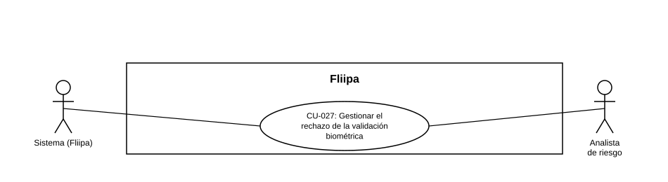

### CU-027: Gestionar el rechazo de la validación biométrica

| Campo | Detalle |
|---|---|
| **Actores** | Sistema (Fliipa); Analista de riesgo (secundario, cuando el rechazo se origina en revisión manual) |
| **Descripción** | El sistema cierra la solicitud del cliente y lo notifica cuando el resultado de la validación biométrica es "rechazado", ya sea de forma automática (webhook de Olimpia) o tras la confirmación del analista de riesgo luego de revisar manualmente un caso "en revisión" (ver CU-005). |
| **Precondiciones** | Existe un resultado biométrico "rechazado" (automático) o un caso "en revisión" que el analista de riesgo confirmó como rechazado. |
| **Flujo principal** | 1. El sistema recibe el resultado "rechazado" (directamente de Olimpia o de la decisión del analista). 2. El sistema marca la solicitud del cliente con estado final de rechazo. 3. El sistema bloquea el avance a los siguientes pasos del onboarding (vinculación bancaria, soportes, etc.). 4. El sistema registra el causal de rechazo (automático o manual) para trazabilidad interna. 5. El sistema notifica al cliente por correo y/o WhatsApp que su solicitud no pudo continuar, sin exponer el causal técnico. |
| **Flujos alternativos / excepciones** | A1. El rechazo es automático (Olimpia): puede requerir confirmación de un analista antes de notificar al cliente (pendiente de confirmar con el dueño del proceso, ver HU-046). A2. El cliente intenta reiniciar el flujo de biometría tras el rechazo definitivo: el sistema no lo permite. |
| **Postcondiciones** | La solicitud del cliente queda en estado final de rechazo, con causal registrado, y el cliente fue notificado. |
| **Reglas de negocio** | Ningún rechazo biométrico (automático o manual) debe dejar al cliente sin notificación ni a la solicitud en un estado intermedio indefinido. La notificación al cliente no debe exponer el motivo técnico ni el causal interno del rechazo. |
| **Historias de usuario relacionadas** | [HU-046](../../Historias%20De%20Usuario/2.%20KYC/HU-046%20Manejo%20de%20rechazo%20en%20biometr%C3%ADa.md) (Manejo de rechazo en biometría) |
| **Estado en plataforma** | No se encontró en el repositorio revisado lógica de biometría, integración con Olimpia, ni notificación de rechazo biométrico (se buscó "biometria" y "Olimpia" en todo el repositorio, sin resultados). Sin respaldo verificable en el código fuente entregado. |
| **Referencias** | Fuente: ficha [HU-046](../../Historias%20De%20Usuario/2.%20KYC/HU-046%20Manejo%20de%20rechazo%20en%20biometr%C3%ADa.md) (Manejo de rechazo en biometría) y [Procesos — 01 Onboarding Digital](../../../Operaciones/Procesos/01%20Onboarding%20Digital.md), pasos 14-15 — *Historias de Usuario — Fliipa*, carpeta "2. KYC" (repositorio `documentacion_fliipa`, María Fernanda Herazo). |
