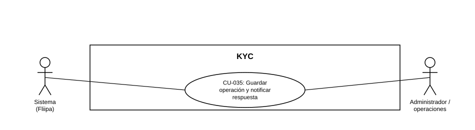

### CU-035: Guardar operación y notificar respuesta de la operación

| Campo | Detalle |
|---|---|
| **Actores** | Sistema (Fliipa); Administrador / operaciones (receptor de la alerta) |
| **Descripción** | Cuando un proveedor externo entrega el resultado de una operación asociada a una solicitud (por ejemplo, el resultado de la validación biométrica de [CU-004](CU-004%20Completar%20validaci%C3%B3n%20biometrica.md)), el sistema guarda ese resultado en la solicitud y notifica la respuesta al flujo operativo mediante una alerta que indica la acción a seguir. |
| **Precondiciones** | Existe una operación en curso, asociada a una solicitud, cuyo resultado depende de un proveedor externo. |
| **Flujo principal** | 1. El proveedor externo entrega el resultado de la operación al sistema. 2. El sistema guarda ese resultado en la solicitud correspondiente. 3. El sistema notifica la respuesta al flujo operativo mediante una alerta operativa, indicando la acción a seguir: **avanzar**, **bloquear**, o **enviar a revisión manual**. 4. El administrador/operaciones recibe la alerta y puede consultar el resultado guardado en la solicitud. |
| **Flujos alternativos / excepciones** | A1. El resultado llega en un formato o estado no reconocido por el sistema: la alerta se genera igualmente, marcada por defecto para revisión manual. |
| **Postcondiciones** | La solicitud queda con el resultado de la operación guardado, y el equipo de operaciones recibió la alerta con la acción correspondiente (avanzar, bloquear, o revisar manualmente). |
| **Reglas de negocio** | Toda operación externa que entregue un resultado debe guardarse en la solicitud **antes** de generar cualquier alerta. La alerta debe indicar siempre una de tres acciones: avanzar, bloquear, o revisar manualmente. Este caso de uso es **genérico**: aplica a cualquier operación con proveedor externo que requiera guardar un resultado y notificarlo (el primer caso identificado es el resultado de biometría de CU-004; podría reutilizarse para otros proveedores externos del flujo de KYC). |
| **Historias de usuario relacionadas** | Sin historia de usuario propia todavía. El criterio de aceptación de [HU-006](../../Historias%20De%20Usuario/1.%20Onboarding/HU-006%20Completar%20la%20validaci%C3%B3n%20biom%C3%A9trica%20%28KYC%29.md) menciona "el sistema registra el resultado", que es el origen de este caso de uso, pero HU-006 no describe la alerta operativa (avanzar/bloquear/revisar) ni el carácter genérico de este mecanismo. Se recomienda crear una historia de usuario propia para este caso de uso y validarla con negocio. |
| **Estado en plataforma** | No se encontró en el código revisado ningún mecanismo de alerta operativa (avanzar/bloquear/revisar manualmente) ni integración con proveedores externos que la disparen; consistente con que la biometría (CU-004) tampoco está implementada hoy. |
| **Referencias** | Fuente: nota de corrección sobre [CU-004](CU-004%20Completar%20validaci%C3%B3n%20biometrica.md) (28/08/2026) y ficha [HU-006](../../Historias%20De%20Usuario/1.%20Onboarding/HU-006%20Completar%20la%20validaci%C3%B3n%20biom%C3%A9trica%20%28KYC%29.md) — *Historias de Usuario — Fliipa*, carpeta "1. Onboarding" (repositorio `documentacion_fliipa`, María Fernanda Herazo). |

> **Nota de versión (2026-08-28):** caso de uso nuevo, creado al separar de [CU-004](CU-004%20Completar%20validaci%C3%B3n%20biometrica.md) el guardado del resultado y la notificación operativa (que HU-006 sí incluía en su criterio de aceptación, mezclado con el flujo del cliente). Se le da carácter genérico porque el mecanismo de "guardar resultado + alertar con una acción (avanzar/bloquear/revisar)" no es exclusivo de la biometría, y podría aplicar a otras integraciones del flujo de KYC. Se asigna el consecutivo CU-035 por ser el siguiente disponible tras auditar todo el repositorio (ver hallazgo de numeración en el `README.md` de este catálogo); se recomienda validar con negocio si este caso de uso debe mantenerse genérico o si conviene una ficha específica por cada proveedor/operación.