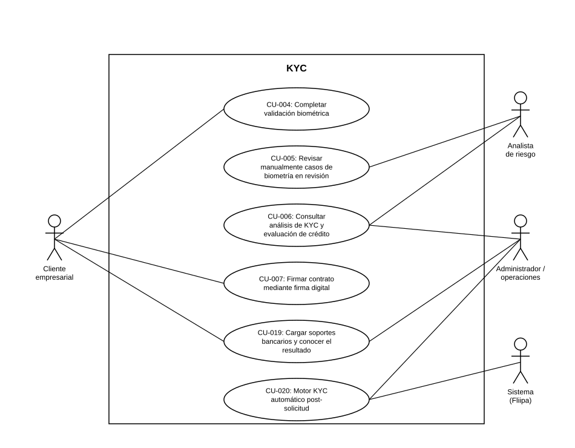

# Diagrama de Casos de Uso — KYC

**Actores del capítulo:** Cliente empresarial, Analista de riesgo, Administrador / operaciones, Sistema (Fliipa)

**Casos de uso incluidos:**

- [CU-004](CU-004%20Completar%20validación%20biométrica.md)
- [CU-005](CU-005%20Revisar%20manualmente%20casos%20de%20biometría%20en%20revisión.md)
- [CU-006](CU-006%20Consultar%20análisis%20de%20KYC%20y%20evaluación%20de%20crédito.md)
- [CU-007](CU-007%20Firmar%20contrato%20mediante%20firma%20digital.md)
- [CU-019](CU-019%20Cargar%20soportes%20bancarios%20y%20conocer%20el%20resultado.md)
- [CU-020](CU-020%20Motor%20KYC%20automático%20post-solicitud.md)

> Diagrama UML de casos de uso generado a partir de las fichas de este capítulo (ver `README.md` del proyecto para la tabla de correspondencia Historias de Usuario → Casos de Uso).
