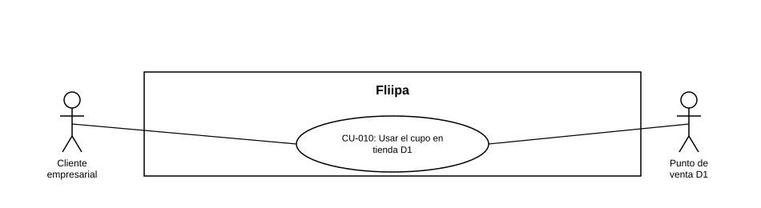

### CU-010: Usar el cupo en tienda D1

| Campo | Detalle |
|---|---|
| **Actores** | Cliente empresarial; Punto de venta D1 |
| **Descripción** | El cliente puede ver el código de compra en su portal  para usar su cupo aprobado en la tienda D1 y pagar su mercancía sin dinero en efectivo. |
| **Precondiciones** | El cliente cuenta con cupo disponible en estado Aprobado o Activa (ver [CU-009](CU-009 Consultar cupo, plan de pagos y disponibilidad de credito.md)). |
| **Flujo principal** | 1. El sistema genera un código asociado al cliente. 2. El cliente ve ese código en su portal. 3. El cliente presenta el código en el punto de venta D1. 4. El punto de venta valida el código. 5. El sistema aplica el cupo a la compra. |
| **Flujos alternativos / excepciones** | A1. El código no es válido o ya fue utilizado: el punto de venta rechaza la aplicación del cupo. |
| **Postcondiciones** | La compra queda pagada con cargo al cupo del cliente y el movimiento se refleja en su plan de pagos. |
| **Reglas de negocio** | El código de compra debe validarse en el punto de venta antes de aplicar el cupo. |
| **Historias de usuario relacionadas** | [HU-012](../../Historias De Usuario/3. Credito/HU-012 Usar el cupo en tienda D1.md) (Usar el cupo en tienda D1)|
| **Estado en plataforma** | Parcial: el cliente puede ver el código de compra en el portal; la validación y aplicación del código en caja D1 no están implementadas hoy. |
| **Referencias** | Fuente: ficha [HU-012](../../Historias De Usuario/3. Credito/HU-012 Usar el cupo en tienda D1.md) (Usar el cupo en tienda D1) — *Historias de Usuario — Fliipa*, carpeta "3. Credito" (repositorio `documentacion_fliipa`, María Fernanda Herazo). |
