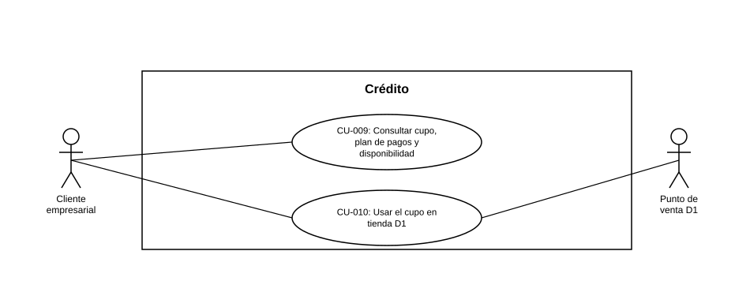

# Diagrama de Casos de Uso — Crédito

**Actores del capítulo:** Cliente empresarial, Punto de venta D1

**Casos de uso incluidos:**

- [CU-009](CU-009%20Consultar%20cupo,%20plan%20de%20pagos%20y%20disponibilidad.md)
- [CU-010](CU-010%20Usar%20el%20cupo%20en%20tienda%20D1.md)

> Diagrama UML de casos de uso generado a partir de las fichas de este capítulo (ver `README.md` del proyecto para la tabla de correspondencia Historias de Usuario → Casos de Uso).
