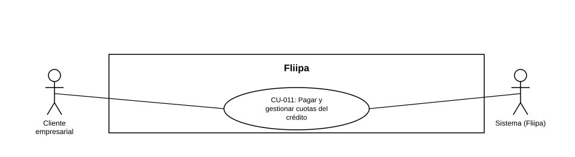

### CU-011: Pagar cuota por PSE

| Campo | Detalle |
|---|---|
| **Actores** | Cliente empresarial |
| **Descripción** | El cliente prepaga su cuota antes de la fecha de vencimiento mediante PSE, de forma voluntaria. Hoy no hay pago por PSE implementado en el repositorio. |
| **Precondiciones** | El cliente tiene una cuota vigente asociada a su línea de crédito. |
| **Flujo principal** | 1. El cliente inicia el pago de su cuota en cualquier momento antes de la fecha de vencimiento, mediante PSE. 2. El sistema reflejaría el pago en el plan de pagos y en el cupo disponible del cliente. |
| **Flujos alternativos / excepciones** | A1. El pago por PSE no se completaría: la cuota permanecería pendiente. |
| **Postcondiciones** | La cuota quedaría pagada por PSE y reflejada en el plan de pagos y el cupo del cliente. Hoy el pago efectivo por PSE de punta a punta no está disponible. |
| **Reglas de negocio** | El pago por PSE es un proceso voluntario e iniciado por el cliente, distinto del débito automático (ver [CU-026](CU-026%20Gestionar%20debito%20automatico%20de%20creditos%20vencidos.md)), aunque ambos usarían Druo como conector bancario. |
| **Historias de usuario relacionadas** | [HU-013](../../Historias%20De%20Usuario/4.%20Cobranza/HU-013%20Prepagar%20la%20cuota%20por%20PSE.md) (Prepagar la cuota por PSE) |
| **Estado en plataforma** | No se encontró implementación de pago por PSE en el repositorio (búsqueda de "PSE" sin coincidencias). |
| **Referencias** | Fuente: ficha [HU-013](../../Historias%20De%20Usuario/4.%20Cobranza/HU-013%20Prepagar%20la%20cuota%20por%20PSE.md) — *Historias de Usuario — Fliipa*, carpeta "4. Cobranza" (repositorio `documentacion_fliipa`, María Fernanda Herazo). |

> **Nota de versión (2026-08-27):** Este caso de uso se separó del CU-011 original (v1.0 del catálogo), que combinaba el pago voluntario por PSE y el débito automático de créditos vencidos en una sola ficha. El débito automático ahora vive en [CU-026](CU-026%20Gestionar%20debito%20automatico%20de%20creditos%20vencidos.md), ya que son procesos distintos: uno lo inicia el cliente (actor: Cliente empresarial) y el otro lo ejecuta el sistema (actor: Sistema/Fliipa) sobre cartera vencida.
