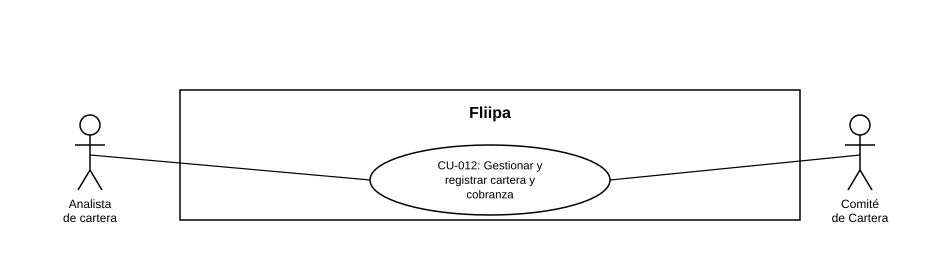

### CU-012: Gestionar y registrar cartera y cobranza

| Campo | Detalle |
|---|---|
| **Actores** | Analista de cartera |
| **Descripción** | El analista de cartera contacta al cliente y registra cada interacción de cobranza realizada (canal, tipo de contacto, resultado, monto comprometido). |
| **Precondiciones** | Existen créditos en distintos estados de mora dentro de la cartera. |
| **Flujo principal** | 1. El analista contacta al cliente y registra la interacción (canal, tipo de contacto, resultado, monto comprometido). 2. El registro queda disponible en el resumen de atención del cliente. |
| **Flujos alternativos / excepciones** | A1. El analista necesita corregir una interacción ya registrada: edita la nota de cobranza existente (`updateCollectionNoteService`). A2. El analista registra una nota por error o duplicada: puede eliminarla (borrado lógico, `deleteCollectionNoteService`); la nota deja de listarse pero no se borra físicamente. |
| **Postcondiciones** | Cada interacción de cobranza queda registrada y trazable en el resumen de atención del cliente. Registrar en la nota un resultado del tipo "alivio" (por ejemplo, que el cliente pidió un alivio) **no** aplica por sí solo el alivio financiero sobre el crédito: eso requiere el proceso de CU-013, hoy también no disponible. |
| **Reglas de negocio** | Toda interacción de cobranza debe registrar canal, tipo de contacto, resultado y compromiso de pago. |
| **Historias de usuario relacionadas** | [HU-025](../../Historias De Usuario/4. Cobranza/HU-025 Registrar cada interacciÛn de cobranza.md) (Registrar cada interacci√≥n de cobranza) |
| **Estado en plataforma** | El registro de interacciones de cobranza está completamente implementado: creación, edición y borrado lógico de notas (`create-collection-note.service.ts`, `update-collection-note.service.ts`, `delete-collection-note.service.ts`), listado (`list-collection-notes.service.ts`) y resumen de atención (`collection-notes-attention-summary.service.ts`). |
| **Referencias** | Fuente: ficha [HU-025](../../Historias De Usuario/4. Cobranza/HU-025 Registrar cada interacciÛn de cobranza.md) ‚Äî *Historias de Usuario ‚Äî Fliipa*, carpeta "4. Cobranza" (repositorio `documentacion_fliipa`, Mar√≠a Fernanda Herazo). |
