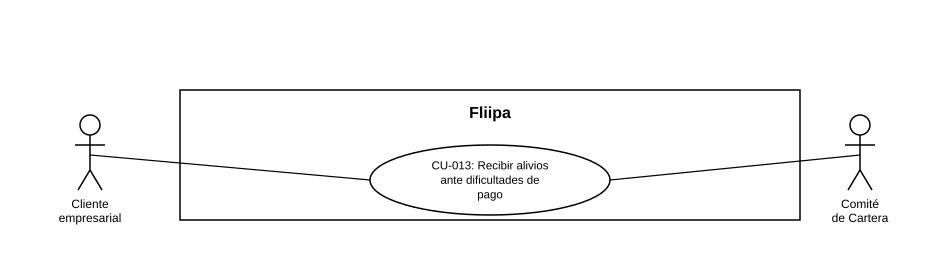

### CU-013: Recibir alivios ante dificultades de pago

| Campo | Detalle |
|---|---|
| **Actores** | Cliente empresarial; Comité de Cartera |
| **Descripción** | *(No disponible en la plataforma / proceso externo-manual — ver Estado en plataforma.)* Diseño previsto: el cliente accedería a alivios (abono parcial, congelamiento de intereses o condonación) cuando tiene dificultades temporales de pago, según las condiciones y topes definidos por bucket de mora, apoyado en el tablero semanal del Comité de Cartera (ver [CU-012](CU-012%20Gestionar%20y%20registrar%20cartera%20y%20cobranza.md), también sin buckets/tablero implementados hoy). |
| **Precondiciones** | (Diseño) El cliente presentaría mora o dificultades temporales de pago, ubicadas dentro de un bucket con alivio definido. |
| **Flujo principal** | *(Flujo de diseño, no vigente en la plataforma hoy)* 1. El cliente manifestaría dificultades de pago o el sistema identificaría su situación de mora. 2. El sistema (o el Comité de Cartera) evaluaría las condiciones y topes definidos para el bucket de mora del cliente. 3. Se aplicaría el alivio correspondiente: abono parcial, congelamiento de intereses o condonación. 4. El cliente conservaría su cupo y su historial. |
| **Flujos alternativos / excepciones** | A1. (Diseño) Si el cliente no cumpliera las condiciones del bucket para ningún alivio, el caso continuaría el flujo estándar de cobranza (ver [CU-012](CU-012%20Gestionar%20y%20registrar%20cartera%20y%20cobranza.md)) o escalaría a jurídico (ver [CU-021](CU-021%20Escalar%20casos%20a%20cobro%20juridico.md)). |
| **Postcondiciones** | (Diseño) El cliente recibiría el alivio aplicable sin perder su cupo ni su historial de crédito. Hoy este CU no está disponible en la plataforma. |
| **Reglas de negocio** | (Diseño) Los alivios (abono parcial, congelamiento de intereses, condonación) estarían sujetos a condiciones y topes definidos por bucket de mora; no aplicable hoy porque el módulo no existe. |
| **Historias de usuario relacionadas** |[HU-015](../../Historias%20De%20Usuario/4.%20Cobranza/HU-015%20Recibir%20alivios%20ante%20dificultades%20de%20pago.md) (Recibir alivios ante dificultades de pago) |
| **Estado en plataforma** | No se encontró ningún módulo de alivios, condonación ni lógica de "bucket de mora" en el código revisado. Funcionalidad aparentemente no implementada en el código fuente entregado, o soportada por un sistema externo/manual; se recomienda confirmar con negocio. |
| **Referencias** | Fuente: ficha [HU-015](../../Historias%20De%20Usuario/4.%20Cobranza/HU-015%20Recibir%20alivios%20ante%20dificultades%20de%20pago.md) — *Historias de Usuario — Fliipa*, carpeta "4. Cobranza" (repositorio `documentacion_fliipa`, María Fernanda Herazo). El tablero semanal del Comité de Cartera (HU-026) corresponde a [CU-012](CU-012%20Gestionar%20y%20registrar%20cartera%20y%20cobranza.md), no a este CU. |
