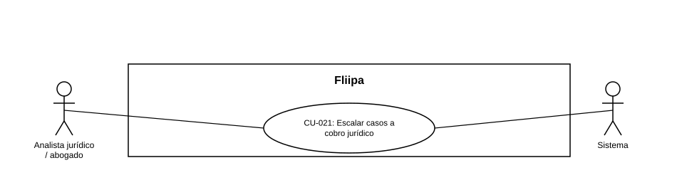

### CU-021: Escalar casos a cobro jurídico

> **Nota:** HU-027 no traía un número de CU asignado en el documento fuente (campo "Relaciones" vacío); se asigna el consecutivo **CU-021**.

| Campo | Detalle |
|:---:|:---:|
| **Actores** | Analista jurídico / abogado; Sistema (Fliipa) |
| **Descripción** | Los casos que alcanzan el bucket de escalamiento jurídico se enrutan automáticamente al analista jurídico, para iniciar el proceso de cobro legal sin depender de un traspaso manual. |
| **Precondiciones** | Un caso de cartera alcanza el bucket de escalamiento jurídico definido en las reglas de gestión y escalamiento (ver CU-012). |
| **Flujo principal** | 1. El sistema identifica que un caso alcanzó el bucket de escalamiento jurídico. 2. El sistema enruta automáticamente el caso al analista jurídico. 3. El analista jurídico recibe el caso e inicia el proceso de cobro jurídico. |
| **Flujos alternativos / excepciones** | A1. El caso sale del bucket de escalamiento antes de ser tomado (por ejemplo, por un pago o alivio aplicado, ver CU-013): el enrutamiento automático no debería continuar (comportamiento no verificado en código). |
| **Postcondiciones** | El caso queda asignado al analista jurídico y se inicia el proceso de cobro legal correspondiente. |
| **Reglas de negocio** | El enrutamiento al analista jurídico debe ser automático, sin depender de un traspaso manual entre áreas. |
| **Historias de usuario relacionadas** | HU-027 (Recibir casos de escalamiento jurídico automáticamente) |
| **Estado en plataforma** | Sin respaldo en el código revisado, consistente con la ausencia general de lógica de buckets de mora (ver CU-012). Depende de resolver primero la discrepancia de plazos de escalamiento documentada en los requerimientos no funcionales (RNF-017). |
| **Referencias** | Fuente: ficha HU-027 — *Historias de Usuario — Fliipa*, carpeta "4. Cobranza" (repositorio `documentacion_fliipa`, María Fernanda Herazo). |
