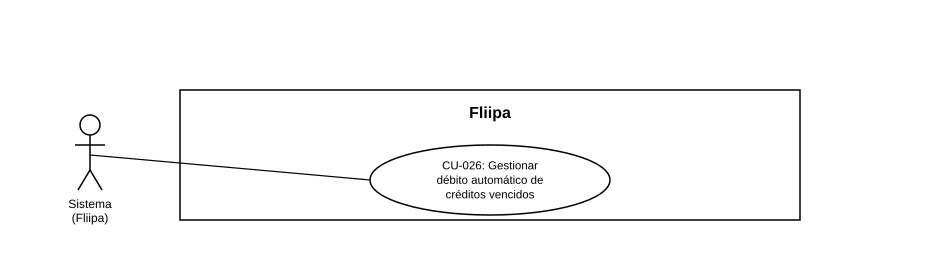

### CU-026: Gestionar débito automático de créditos vencidos

| Campo | Detalle |
|---|---|
| **Actores** | Sistema (Fliipa) |
| **Descripción** | El sistema gestiona el débito automático de créditos que superaron su fecha de pago y mantienen saldo pendiente, sin depender de una acción manual del cliente. Hoy solo existe la conexión de cuenta con Druo y la recepción de eventos asociados; el débito automático de punta a punta no está implementado. |
| **Precondiciones** | El crédito está vencido y mantiene saldo pendiente. La cuenta bancaria del cliente debe estar conectada y vigente mediante Druo (esta parte sí está implementada). |
| **Flujo principal** | 1. El sistema identifica los créditos vencidos candidatos a débito automático según las reglas de cartera definidas. 2. El sistema conecta y mantiene la cuenta bancaria del cliente vía Druo y recibe sus eventos asociados. 3. El sistema ejecutaría el débito conforme a las reglas definidas y registraría el resultado del intento. |
| **Flujos alternativos / excepciones** | A1. La cuenta Druo del cliente no está conectada o vigente.   A2. el crédito no es candidato a débito automático hasta reconectarla.   A3.El sistema envía solicitud de conexión a Druo y reintenta al día siguiente enviando una alerta operativa (ver [CU-024](../6.%20Operaci%C3%B3n%20Admin/CU-024%20Ver%20y%20reconectar%20la%20cuenta%20Druo%20del%20cliente.md)). |
| **Postcondiciones** | La cuota quedaría pagada por débito automático y reflejada en el plan de pagos y el cupo del cliente. Hoy, lo único que se puede dar por hecho es la conexión Druo y sus eventos; el débito automático de punta a punta no está disponible. |
| **Reglas de negocio** | El débito automático es un proceso ejecutado por el sistema sobre cartera vencida, distinto del prepago voluntario por PSE (ver [CU-011](CU-011%20pagar%20y%20gestionar%20cuotas%20del%20credito%20.md)), aunque ambos usarían Druo como conector bancario. |
| **Historias de usuario relacionadas** | [HU-014](../../Historias%20De%20Usuario/4.%20Cobranza/HU-014%20Debito%20autom%C3%A1tico%20de%20cr%C3%A9ditos%20vencidos.md) (Débito automático de créditos vencidos) |
| **Estado en plataforma** | Solo está implementada la conexión de cuenta con Druo y la recepción de eventos asociados (`debit-bank-account.druo.ts`, `connect-bank-account.druo.ts`, `druo-events.webhook.ts`); el débito automático de punta a punta **no** está implementado como funcionalidad de producto. |
| **Referencias** | Fuente: ficha [HU-014](../../Historias%20De%20Usuario/4.%20Cobranza/HU-014%20Debito%20autom%C3%A1tico%20de%20cr%C3%A9ditos%20vencidos.md) — *Historias de Usuario — Fliipa*, carpeta "4. Cobranza" (repositorio `documentacion_fliipa`, María Fernanda Herazo). |

> **Nota de versión (2026-08-27):** Caso de uso nuevo, creado al separar el CU-011 original (v1.0 del catálogo), que combinaba el pago voluntario por PSE y el débito automático de créditos vencidos en una sola ficha. El pago voluntario por PSE permanece en [CU-011](CU-011%20pagar%20y%20gestionar%20cuotas%20del%20credito%20.md). Se asigna el consecutivo CU-026 por ser el siguiente disponible tras CU-025; se recomienda validarlo con negocio antes de considerarlo definitivo.
