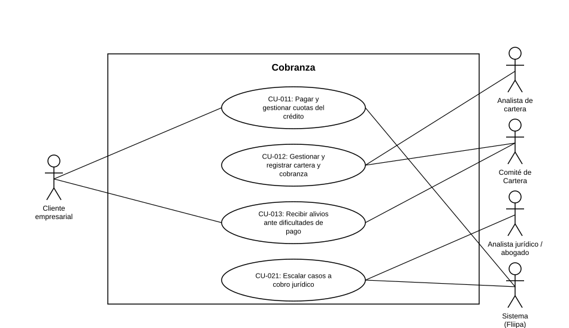

# Diagrama de Casos de Uso — Cobranza

**Actores del capítulo:** Cliente empresarial, Analista de cartera, Comité de Cartera, Analista jurídico / abogado, Sistema (Fliipa)

**Casos de uso incluidos:**

- [CU-011](CU-011%20Pagar%20y%20gestionar%20cuotas%20del%20credito.md)
- [CU-012](CU-012%20Gestionar%20y%20registrar%20cartera%20y%20cobranza.md)
- [CU-013](CU-013%20Recibir%20alivios%20ante%20dificultades%20de%20pago.md)
- [CU-021](CU-021%20Escalar%20casos%20a%20cobro%20juridico.md)

> Diagrama UML de casos de uso generado a partir de las fichas de este capítulo (ver `README.md` del proyecto para la tabla de correspondencia Historias de Usuario → Casos de Uso).
