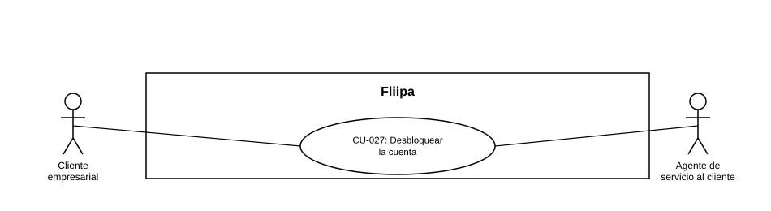

### CU-027: Desbloquear la cuenta

| Campo | Detalle |
|---|---|
| **Actores** | Cliente empresarial; Agente de servicio al cliente |
| **Descripción** | El cliente desbloquea su cuenta cuando queda bloqueada tras varios intentos fallidos de acceso, comunicándose con soporte, para no perder el acceso a su cupo. |
| **Precondiciones** | La cuenta del cliente quedó bloqueada tras varios intentos fallidos de acceso. |
| **Flujo principal** | 1. El cliente se comunica con soporte indicando que su cuenta está bloqueada. 2. El agente de servicio al cliente verifica el estado de bloqueo de la cuenta (intentos fallidos registrados). Esto sí está soportado por el modelo de datos. 3. *(No confirmado)* El agente desbloquearía la cuenta desde un panel administrativo; no se encontró ese flujo de agente en el código revisado, así que no debe darse por implementado. 4. El cliente recupera el acceso a su cuenta. |
| **Flujos alternativos / excepciones** | A1. El cliente no puede verificarse ante soporte: el desbloqueo no procede hasta resolver la verificación de identidad. |
| **Postcondiciones** | La cuenta del cliente queda desbloqueada y recupera el acceso normal. |
| **Reglas de negocio** | El desbloqueo de la cuenta requiere pasar por soporte; no es un autoservicio del cliente. *(Pendiente de confirmar si esto sigue siendo así o si existe/existirá un flujo de agente en panel — hay una mención informal de que esto se discutió en una reunión, pero no está confirmado; se recomienda validar con el equipo antes de tomarlo como definitivo.)* Este caso de uso es distinto de recuperar el PIN (ver [CU-022](CU-022%20Recuperar%20PIN.md)): la cuenta se bloquea automáticamente tras varios intentos fallidos, independientemente de si el cliente recuerda o no su PIN. |
| **Historias de usuario relacionadas** | [HU-018](../../Historias De Usuario/6. Servicio al Cliente/HU-018 Recuperar PIN o desbloquear la cuenta.md) (Recuperar PIN o desbloquear la cuenta) |
| **Estado en plataforma** | Parcial, no "Implementado" en su totalidad. Confirmado en código: bloqueo por intentos fallidos (`loginAttempts`/`lockedAt` en `Client.ts`). No confirmado: un flujo de agente en panel administrativo que desbloquee la cuenta como describe el paso 3; falta verificar esto con el equipo antes de darlo por hecho. |
| **Referencias** | Fuente: ficha [HU-018](../../Historias De Usuario/6. Servicio al Cliente/HU-018 Recuperar PIN o desbloquear la cuenta.md)  — *Historias de Usuario — Fliipa*, carpeta "5. Servicio al Cliente" (repositorio `documentacion_fliipa`, María Fernanda Herazo). |

> **Nota de versión (2026-08-28):** caso de uso nuevo, creado al separar el CU-022 original, que combinaba recuperar el PIN y desbloquear la cuenta en una sola ficha. Recuperar el PIN permanece en [CU-022](CU-022%20Recuperar%20PIN.md). Se asigna el consecutivo CU-027 por ser el siguiente disponible tras CU-026; se recomienda validarlo con negocio antes de considerarlo definitivo. Nota: en el Acta de Check-in de Producto del 27/08/2026 se había discutido esta misma división y en ese momento se prefirió dejarlo unificado; esta separación revierte esa decisión a solicitud explícita de negocio (28/08/2026).