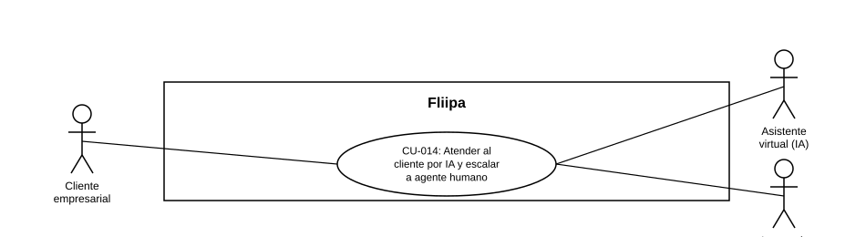

### CU-014: Atender al cliente por IA y escalar a agente humano

| Campo | Detalle |
|---|---|
| **Actores** | Cliente empresarial; Asistente virtual (IA); Agente de servicio al cliente |
| **Descripción** | *(No forma parte de esta plataforma — opera, si existe, en una herramienta externa. Ver Estado en plataforma.)* Diseño previsto: un asistente virtual con IA atendería el primer contacto del cliente por WhatsApp; si no logra resolver el caso, lo escalaría a un agente humano junto con el contexto completo de la conversación, y en casos críticos (suplantación, uso indebido del cupo) el agente validaría la identidad del cliente antes de aprobar el caso. |
| **Precondiciones** | El cliente inicia contacto por WhatsApp con una duda, solicitud o inquietud. |
| **Flujo principal** | *(Flujo de diseño; no está en esta plataforma, es una herramienta externa)* 1. El cliente escribe por WhatsApp. 2. El asistente virtual con IA recibiría y respondería dentro de las dudas frecuentes definidas en su alcance. 3. Si el asistente no lograra resolver el caso, se escalaría a un agente humano. 4. El agente humano recibiría el caso con el historial completo de la conversación, sin necesidad de que el cliente repita su problema. 5. Si el caso es crítico (suplantación, uso indebido del cupo), el agente validaría la identidad del cliente antes de aprobar el caso, con aprobación manual explícita. |
| **Flujos alternativos / excepciones** | A1. (Diseño) El asistente resolvería el caso sin necesidad de escalamiento: el flujo terminaría en el paso 2. A2. (Diseño) El caso crítico no pasa la validación de identidad: no se aprueba y queda pendiente de revisión adicional. |
| **Postcondiciones** | (Diseño) El cliente recibiría una respuesta a su consulta, ya sea por IA o por un agente humano, y los casos críticos quedarían validados antes de cerrarse. Esto no ocurre hoy dentro de esta plataforma. |
| **Reglas de negocio** | (Diseño) Los casos críticos requerirían validación de identidad y aprobación manual explícita antes de cerrarse. La atención por IA y el escalamiento a humano, de existir, son procesos externos a esta plataforma. |
| **Historias de usuario relacionadas** |[HU-016](../../Historias%20De%20Usuario/6.%20Servicio%20al%20Cliente/HU-016%20Atencion%20inicial%20por%20asistente%20virtual%20con%20IA.md) (Atención inicial por asistente virtual con IA) [HU-017](../../Historias%20De%20Usuario/6.%20Servicio%20al%20Cliente/HU-017%20Escalar%20a%20agente%20humano%20cuando%20la%20IA%20no%20resuelve%20el%20caso.md) (Escalar a agente humano cuando la IA no resuelve el caso) [HU-028](../../Historias%20De%20Usuario/6.%20Servicio%20al%20Cliente/HU-028%20Recibir%20el%20caso%20escalado%20con%20contexto%20completo.md) (Recibir el caso escalado con contexto completo) [HU-029](../../Historias%20De%20Usuario/6.%20Servicio%20al%20Cliente/HU-029%20Validar%20identidad%20en%20casos%20cr%C3%ADticos.md) (Validar identidad en casos críticos) |
| **Estado en plataforma** | No se encontró en el código revisado ningún módulo de asistente conversacional de IA ni lógica de escalamiento; los controladores del microservicio `communications` se limitan al envío de OTP, firma y contrato por WhatsApp/correo. Probablemente vive en una herramienta externa no incluida en este repositorio. |
| **Referencias** | Fuente: fichas [HU-016](../../Historias%20De%20Usuario/6.%20Servicio%20al%20Cliente/HU-016%20Atencion%20inicial%20por%20asistente%20virtual%20con%20IA.md), [HU-017](../../Historias%20De%20Usuario/6.%20Servicio%20al%20Cliente/HU-017%20Escalar%20a%20agente%20humano%20cuando%20la%20IA%20no%20resuelve%20el%20caso.md) , [HU-028](../../Historias%20De%20Usuario/6.%20Servicio%20al%20Cliente/HU-028%20Recibir%20el%20caso%20escalado%20con%20contexto%20completo.md)  y [HU-029](../../Historias%20De%20Usuario/6.%20Servicio%20al%20Cliente/HU-029%20Validar%20identidad%20en%20casos%20cr%C3%ADticos.md)— *Historias de Usuario — Fliipa*, carpeta "5. Servicio al Cliente" (repositorio `documentacion_fliipa`, María Fernanda Herazo). |
