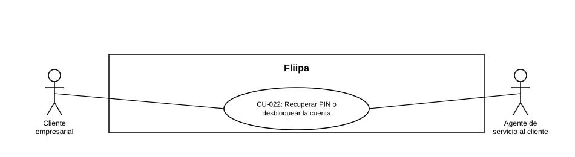

### CU-022: Recuperar PIN

> **Nota:** HU-018 no traía un número de CU asignado (solo referenciaba el requerimiento RNF-014); se asigna el consecutivo **CU-022**.

| Campo | Detalle |
|---|---|
| **Actores** | Cliente empresarial; Agente de servicio al cliente |
| **Descripción** | El cliente recupera su PIN cuando lo olvida, comunicándose con soporte, para no perder el acceso a su cupo. |
| **Precondiciones** | El cliente olvidó su PIN de acceso. |
| **Flujo principal** | 1. El cliente se comunica con soporte indicando que olvidó su PIN. 2. El agente de servicio al cliente verifica la identidad del cliente y la situación de su cuenta. Esto sí está soportado por el modelo de datos. 3. *(No confirmado)* El agente ayudaría al cliente a generar un nuevo PIN desde un panel; no se encontró ese flujo de agente en el código revisado, así que no debe darse por implementado. 4. El cliente recupera el acceso a su cupo con el nuevo PIN, mediante el componente `ResetPin.tsx` disponible en el flujo de login. |
| **Flujos alternativos / excepciones** | A1. El cliente no puede verificarse ante soporte: la generación del nuevo PIN no procede hasta resolver la verificación de identidad. |
| **Postcondiciones** | El cliente recupera el acceso a su cuenta con un PIN nuevo y válido. |
| **Reglas de negocio** | La generación de un nuevo PIN requiere pasar por soporte; no es un autoservicio del cliente. *(Pendiente de confirmar si esto sigue siendo así o si existe/existirá un flujo de agente en panel — hay una mención informal de que esto se discutió en una reunión, pero no está confirmado; se recomienda validar con el equipo antes de tomarlo como definitivo.)* Este caso de uso es distinto de desbloquear la cuenta (ver [CU-027](CU-027%20Desbloquear%20la%20cuenta.md)): el cliente puede olvidar su PIN sin que su cuenta esté bloqueada. |
| **Historias de usuario relacionadas** | [HU-018](../../Historias%20De%20Usuario/6.%20Servicio%20al%20Cliente/HU-018%20Recuperar%20PIN%20o%20desbloquear%20la%20cuenta.md) (Recuperar PIN o desbloquear la cuenta) |
| **Estado en plataforma** | Parcial, no "Implementado" en su totalidad. Confirmado en código: el componente `ResetPin.tsx` dentro del flujo de login de `fliipa-redemption`. No confirmado: un flujo de agente en panel administrativo que genere un nuevo PIN como describe el paso 3; falta verificar esto con el equipo antes de darlo por hecho. |
| **Referencias** | Fuente: ficha [HU-018](../../Historias%20De%20Usuario/6.%20Servicio%20al%20Cliente/HU-018%20Recuperar%20PIN%20o%20desbloquear%20la%20cuenta.md)  — *Historias de Usuario — Fliipa*, carpeta "5. Servicio al Cliente" (repositorio `documentacion_fliipa`, María Fernanda Herazo). |

> **Nota de versión (2026-08-28):** este caso de uso se separó del CU-022 original, que combinaba recuperar el PIN y desbloquear la cuenta en una sola ficha. El desbloqueo de cuenta ahora vive en [CU-027](CU-027%20Desbloquear%20la%20cuenta.md), ya que son disparadores distintos (olvido de PIN vs. bloqueo por intentos fallidos), aunque ambos requieren la intervención del agente de servicio al cliente.