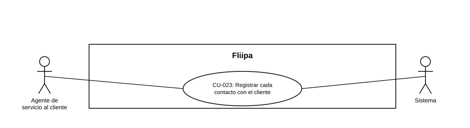

### CU-023: Registrar cada contacto con el cliente

> **Nota:** HU-030 no traía un número de CU asignado; se asigna el consecutivo **CU-023**.

| Campo | Detalle |
|:---:|:---:|
| **Actores** | Agente de servicio al cliente; Sistema (Fliipa) |
| **Descripción** | Cada contacto que se tiene con el cliente, sin importar el canal (WhatsApp, correo, llamada, asistente virtual o agente humano) o el motivo (KYC, biometría, atención, cobranza), queda registrado para mantener trazabilidad completa de toda la atención brindada. |
| **Precondiciones** | Se produce un contacto con el cliente por cualquier canal soportado. |
| **Flujo principal** | 1. Se produce un contacto con el cliente (por WhatsApp, correo, llamada, asistente virtual o agente humano). 2. El sistema o el agente registra canal, motivo, resultado y fecha del contacto. 3. El registro queda disponible en el historial general de atención del cliente, independientemente de si el contacto está o no relacionado con cobranza. |
| **Flujos alternativos / excepciones** | A1. El contacto es de cobranza: además de este registro general, se guarda en el módulo específico de notas de cobranza (ver CU-012). |
| **Postcondiciones** | El cliente cuenta con un historial de atención completo y trazable, sin importar el canal o el motivo del contacto. |
| **Reglas de negocio** | El registro debe cubrir todos los canales y motivos de contacto, no solo la gestión de cobranza. |
| **Historias de usuario relacionadas** | HU-030 (Registrar cada contacto con el cliente); relacionada con HU-006, HU-007, HU-016, HU-017, HU-025, HU-028, HU-029 |
| **Estado en plataforma** | Ya existe un registro de notas de cobranza (`collection-notes.ts`, ver HU-025), pero no se encontró un registro general de contacto que cubra todos los flujos (KYC, biometría, atención por IA, atención humana, etc.). Pendiente de verificar en código. |
| **Referencias** | Fuente: ficha HU-030 — *Historias de Usuario — Fliipa*, carpeta "5. Servicio al Cliente" (repositorio `documentacion_fliipa`, María Fernanda Herazo). |
