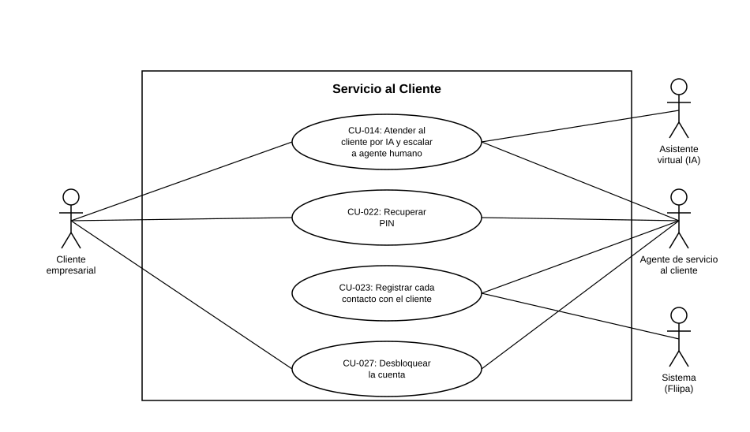

# Diagrama de Casos de Uso — Servicio al Cliente

**Actores del capítulo:** Cliente empresarial, Asistente virtual (IA), Agente de servicio al cliente, Sistema (Fliipa)

**Casos de uso incluidos:**

- [CU-014](CU-014%20Atender%20al%20cliente%20por%20IA%20y%20escalar%20a%20agente%20humano.md)
- [CU-022](CU-022%20Recuperar%20PIN%20o%20desbloquear%20la%20cuenta.md)
- [CU-023](CU-023%20Registrar%20cada%20contacto%20con%20el%20cliente.md)

> Diagrama UML de casos de uso generado a partir de las fichas de este capítulo (ver `README.md` del proyecto para la tabla de correspondencia Historias de Usuario → Casos de Uso).
