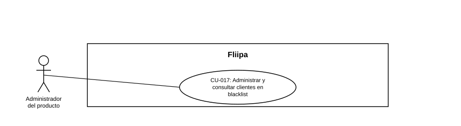

### CU-017: Administrar y consultar clientes en blacklist

| Campo | Detalle |
|---|---|
| **Actores** | Administrador del producto |
| **Descripción** | El administrador agrega o retira clientes de la lista negra (blacklist) para bloquear casos de fraude confirmado, registrando el motivo de ingreso, y puede consultar el listado completo de clientes en blacklist junto con dicho motivo. |
| **Precondiciones** | Existe evidencia o decisión de negocio para incluir o retirar a un cliente de la blacklist. |
| **Flujo principal** | 1. El administrador busca al cliente a incluir o retirar de la blacklist. 2. El sistema valida que el cliente exista. 3. El administrador registra el motivo por el cual el cliente ingresa a la lista negra (o el motivo de retiro). 4. El sistema agrega o retira al cliente de la blacklist. 5. El administrador consulta, desde el panel, el listado completo de clientes en blacklist, incluyendo el motivo de ingreso registrado. |
| **Flujos alternativos / excepciones** | A1. El cliente no existe: el sistema no permite la operación. A2. El administrador no tiene permisos suficientes: no puede gestionar ingresos o salidas, solo consultar (según el nivel de permiso). |
| **Postcondiciones** | El cliente queda incluido o retirado de la blacklist con su motivo registrado, y el listado completo queda disponible para consulta en el panel. |
| **Reglas de negocio** | Todo ingreso a blacklist debe registrar un motivo. La consulta y gestión del listado completo requiere permisos administrativos. |
| **Historias de usuario relacionadas** | [HU-034](../../Historias%20De%20Usuario/5.%20Gesti%C3%B3n%20Plataforma%20del%20admin/HU-034%20Administrar%20la%20lista%20negra.md) (Administrar la lista negra) [HU-035](../../Historias%20De%20Usuario/5.%20Gesti%C3%B3n%20Plataforma%20del%20admin/HU-035%20Consultar%20clientes%20en%20blacklist.md) (Consultar y gestionar clientes en blacklist) |
| **Estado en plataforma** | [HU-034](../../Historias%20De%20Usuario/5.%20Gesti%C3%B3n%20Plataforma%20del%20admin/HU-034%20Administrar%20la%20lista%20negra.md) : implementada a nivel de servicio (`add-client-to-blacklist.ts`, `remove-client-client-from-blacklist.ts`); no hay *enforcement* de la blacklist sobre checkout, evaluación de riesgo o desembolso en ningún archivo del repositorio, lo que representa un riesgo de negocio real y verificado. [HU-035](../../Historias%20De%20Usuario/5.%20Gesti%C3%B3n%20Plataforma%20del%20admin/HU-035%20Consultar%20clientes%20en%20blacklist.md): **pendiente de implementar** — no existe hoy una pantalla consultable de blacklist en el panel administrativo. |
| **Referencias** | Fuente: fichas [HU-034](../../Historias%20De%20Usuario/5.%20Gesti%C3%B3n%20Plataforma%20del%20admin/HU-034%20Administrar%20la%20lista%20negra.md)  y [HU-035](../../Historias%20De%20Usuario/5.%20Gesti%C3%B3n%20Plataforma%20del%20admin/HU-035%20Consultar%20clientes%20en%20blacklist.md) — *Historias de Usuario — Fliipa*, carpeta "6. Gestión Plataforma del admin" (repositorio `documentacion_fliipa`, María Fernanda Herazo). |
