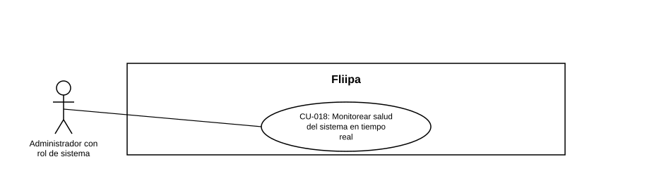

### CU-018: Monitorear salud del sistema en tiempo real

| Campo | Detalle |
|:---:|:---:|
| **Actores** | Administrador con rol de sistema (SYS_ADMIN) |
| **Descripción** | El administrador de sistema consulta en tiempo real la latencia y disponibilidad del core bancario y de la base de datos, para detectar incidentes antes de que afecten a los clientes. |
| **Precondiciones** | El administrador tiene rol SYS_ADMIN y acceso al panel de monitoreo. |
| **Flujo principal** | 1. El administrador de sistema ingresa al panel de monitoreo. 2. El sistema muestra la latencia y disponibilidad del core bancario. 3. El sistema muestra la latencia y disponibilidad de Cloud SQL. 4. El administrador identifica incidentes o degradaciones a partir de estos indicadores. |
| **Flujos alternativos / excepciones** | A1. Un componente de terceros no cubierto por el monitoreo presenta una falla (Experian, Druo, biometría, Zenvia/Sendgrid o el core bancario): el panel actual no lo detecta (ver hallazgo en Estado en plataforma). |
| **Postcondiciones** | El administrador cuenta con visibilidad en tiempo real del estado del core bancario y la base de datos. |
| **Reglas de negocio** | El monitoreo debe cubrir componentes críticos para la continuidad del negocio. |
| **Historias de usuario relacionadas** | HU-036 (Monitorear salud del sistema en tiempo real) |
| **Estado en plataforma** | Implementado (`system-core-health.controller.ts`, `system-cloud-sql.controller.ts`). Hallazgo (RF-033): el monitoreo de terceros solo cubre GitHub, npm y GCP; no cubre Experian, Druo, el proveedor de biometría, Zenvia/Sendgrid ni el core bancario, pese a que el producto los describe como críticos para el negocio. |
| **Referencias** | Fuente: ficha HU-036 — *Historias de Usuario — Fliipa*, carpeta "6. Gestión Plataforma del admin" (repositorio `documentacion_fliipa`, María Fernanda Herazo). |
