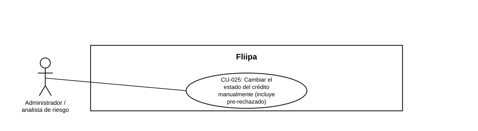

### CU-025: Cambiar el estado del crédito manualmente (incluye pre-rechazado)

> **Nota:** HU-041 no traía un número de CU asignado; se asigna el consecutivo **CU-025**.

| Campo | Detalle |
|:---:|:---:|
| **Actores** | Administrador / analista de riesgo |
| **Descripción** | El administrador cambia manualmente el estado de la línea de crédito del cliente, incluido el estado pre-rechazado (`pre_rejected`), para gestionar casos en evaluación o decisión manual, de forma distinta a la decisión automática del motor KYC (ver CU-020). |
| **Precondiciones** | El administrador cuenta con el permiso correspondiente sobre la ficha del cliente. |
| **Flujo principal** | 1. El administrador abre la ficha del cliente. 2. El administrador selecciona el nuevo estado del crédito, incluyendo la opción `pre_rejected`. 3. El sistema aplica el cambio de estado. 4. Si el nuevo estado es `pre_rejected`, el sistema envía una alerta operativa al equipo. 5. El sistema evita que el cliente reingrese al flujo de forma inconsistente con el nuevo estado. |
| **Flujos alternativos / excepciones** | A1. El cambio de estado proviene de la decisión automática del motor KYC: corresponde a HU-044 / CU-020, no a este caso de uso manual. |
| **Postcondiciones** | La línea de crédito queda con el nuevo estado aplicado manualmente y, si corresponde, el equipo fue alertado. |
| **Reglas de negocio** | El cambio manual de estado es independiente de la decisión automática post-KYC (CU-020); ambos coexisten pero tienen orígenes distintos. |
| **Historias de usuario relacionadas** | HU-041 (Cambiar el estado del crédito, incluye pre-rechazado); relacionada con HU-008 y HU-044 |
| **Estado en plataforma** | Implementado (cambio manual). El cambio automático post-KYC corresponde a HU-044 (CU-020), aún en desarrollo. |
| **Referencias** | Fuente: ficha HU-041 — *Historias de Usuario — Fliipa*, carpeta "6. Gestión Plataforma del admin" (repositorio `documentacion_fliipa`, María Fernanda Herazo). |
