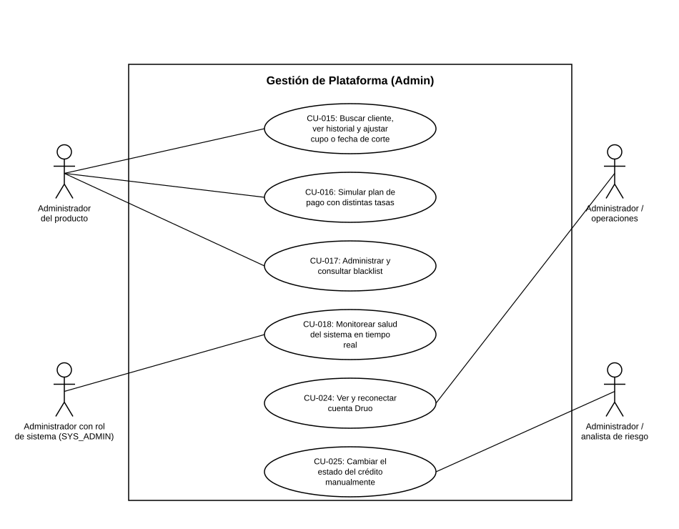

# Diagrama de Casos de Uso — Gestión de Plataforma (Admin)

**Actores del capítulo:** Administrador del producto, Administrador con rol de sistema (SYS_ADMIN), Administrador / operaciones, Administrador / analista de riesgo

**Casos de uso incluidos:**

- [CU-015](CU-015%20Buscar%20cliente,%20ver%20historial%20y%20ajustar%20cupo%20o%20fecha%20de%20corte.md)
- [CU-016](CU-016%20Simular%20plan%20de%20pago%20con%20distintas%20tasas.md)
- [CU-017](CU-017%20Administrar%20y%20consultar%20blacklist.md)
- [CU-018](CU-018%20Monitorear%20salud%20del%20sistema%20en%20tiempo%20real.md)
- [CU-024](CU-024%20Ver%20y%20reconectar%20cuenta%20Druo.md)
- [CU-025](CU-025%20Cambiar%20el%20estado%20del%20crédito%20manualmente.md)

> Diagrama UML de casos de uso generado a partir de las fichas de este capítulo (ver `README.md` del proyecto para la tabla de correspondencia Historias de Usuario → Casos de Uso).
