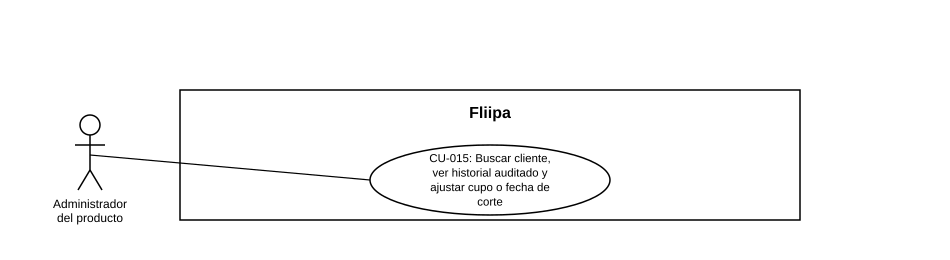

### CU-015: Buscar cliente, ver historial auditado y ajustar cupo o fecha de corte

| Campo | Detalle |
|---|---|
| **Actores** | Administrador del producto |
| **Descripción** | El administrador busca un cliente por documento, consulta el historial de acciones auditadas del panel administrativo sobre ese cliente (no un extracto completo de desembolsos/pagos del core bancario) y, cuando negocio lo autoriza, ajusta el cupo o la fecha de corte de su línea de crédito para corregir casos excepcionales. |
| **Precondiciones** | El cliente existe en la plataforma y tiene operaciones registradas. |
| **Flujo principal** | 1. El administrador busca al cliente por número de documento. 2. El sistema muestra hasta 500 registros de auditoría de acciones realizadas sobre el cliente desde el panel administrativo (por ejemplo, ajustes de línea de crédito); esto no equivale a un extracto completo de desembolsos y pagos del core. 3. Si negocio autorizó un ajuste excepcional, el administrador modifica el cupo o el día de corte de la línea de crédito. 4. El sistema valida que el día de corte esté en el rango de 1 a 30. 5. El sistema registra la acción en auditoría. |
| **Flujos alternativos / excepciones** | A1. El día de corte ingresado está fuera del rango 1–30: el sistema rechaza el ajuste. |
| **Postcondiciones** | El administrador cuenta con el historial auditado (acciones del panel administrativo) del cliente y, si aplicó, el cupo o la fecha de corte quedan ajustados y registrados en auditoría. |
| **Reglas de negocio** | El día de corte debe estar dentro del rango válido de 1 a 30 (para negocio: admin y portal). Toda modificación de cupo o fecha de corte queda registrada en auditoría. |
| **Historias de usuario relacionadas** | [HU-031](../../Historias De Usuario/5. OperaciÛn admin/HU-031 Buscar cliente por documento.md) (Buscar cliente por documento) [HU-032](../../Historias De Usuario/5. OperaciÛn admin/HU-032 Ver historial auditado del cliente.md) (Ver historial auditado del cliente) |
| **Estado en plataforma** | Implementado (`clients.controller.ts` — `getClientAuditedOperations`; `credit-lines.controller.ts`). Hallazgo técnico: a nivel interno, la API de administración aún admite el valor `0` para el día de corte, mientras que redemption exige 1–31; para negocio el rango válido es 1–30. **Hallazgo de trazabilidad:** ninguna HU documenta específicamente el ajuste de cupo o fecha de corte; HU-031 y HU-032 solo cubren búsqueda e historial auditado. |
| **Referencias** | Fuente: fichas [HU-031](../../Historias De Usuario/5. OperaciÛn admin/HU-031 Buscar cliente por documento.md) y [HU-032](../../Historias De Usuario/5. OperaciÛn admin/HU-032 Ver historial auditado del cliente.md) ‚Äî *Historias de Usuario ‚Äî Fliipa*, carpeta "5. Gesti√≥n Plataforma del admin" (repositorio `documentacion_fliipa`, Mar√≠a Fernanda Herazo). |
