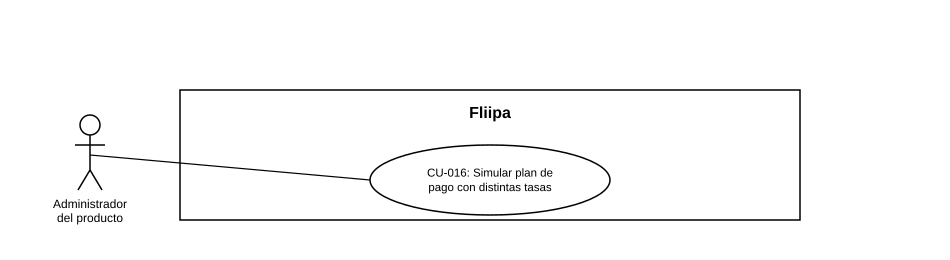

### CU-016: Simular plan de pago con distintas tasas

| Campo | Detalle |
|---|---|
| **Actores** | Administrador del producto |
| **Descripción** | El administrador simula el plan de pago de un cliente en mora usando distintas tasas, para preparar acuerdos de pago o alivios antes de aplicarlos. |
| **Precondiciones** | El cliente presenta mora en su línea de crédito. |
| **Flujo principal** | 1. El administrador ingresa la tasa corriente, la tasa de mora y el umbral de días. 2. El sistema calcula el plan de pago diario correspondiente. 3. El administrador descarga el plan de pago en formato CSV. |
| **Flujos alternativos / excepciones** | A1. Los parámetros ingresados no son válidos: el sistema no genera el cálculo hasta corregirlos. |
| **Postcondiciones** | El administrador cuenta con un plan de pago simulado y descargable para preparar un acuerdo de pago o alivio con el cliente. |
| **Reglas de negocio** | El cálculo depende de tres parámetros: tasa corriente, tasa de mora y umbral de días. |
| **Historias de usuario relacionadas** | [HU-033](../../Historias%20De%20Usuario/5.%20Operaci%C3%B3n%20admin/HU-033%20Simular%20plan%20de%20pago%20con%20distintas%20tasas.md) (Simular plan de pago con distintas tasas) |
| **Estado en plataforma** | Implementado, exactamente con los campos descritos (`calculator.controller.ts` — `getCalculatorStatus`, recibe `currentInterestRate`, `overdueInterestRate`, `thresholdDays`) y con descarga CSV real (`generate-csv-file.ts`, `CalculatorDownloaderButton.tsx`). |
| **Referencias** | Fuente: ficha  [HU-033](../../Historias%20De%20Usuario/5.%20Operaci%C3%B3n%20admin/HU-033%20Simular%20plan%20de%20pago%20con%20distintas%20tasas.md) — *Historias de Usuario — Fliipa*, carpeta "6. Gestión Plataforma del admin" (repositorio `documentacion_fliipa`, María Fernanda Herazo). |
