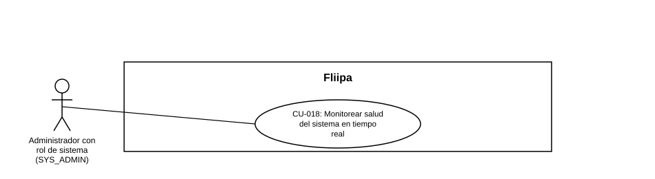

### CU-018: Monitorear salud del sistema en tiempo real

| Campo | Detalle |
|---|---|
| **Actores** | Administrador con rol de sistema (SYS_ADMIN) |
| **Descripción** | El administrador de sistema consulta en tiempo real la latencia y disponibilidad del core bancario y de la base de datos, para detectar incidentes antes de que afecten a los clientes. Se debe ampliar esta cobertura a la mayor cantidad posible de servicios críticos del negocio (Experian, Druo, biometría, mensajería, etc.), ya que hoy el monitoreo solo cubre core y base de datos. |
| **Precondiciones** | El administrador tiene rol SYS_ADMIN y acceso al panel de monitoreo. |
| **Flujo principal** | 1. El administrador de sistema ingresa al panel de monitoreo. 2. El sistema muestra la latencia y disponibilidad del core bancario. 3. El sistema muestra la latencia y disponibilidad de Cloud SQL. 4. El administrador identifica incidentes o degradaciones a partir de estos indicadores. 5. *(Por ampliar)* El sistema debería mostrar también la disponibilidad de otros servicios críticos del negocio (Experian, Druo, biometría, mensajería/Zenvia-Sendgrid), que hoy no están cubiertos por el monitoreo. |
| **Flujos alternativos / excepciones** | A1. Un componente de terceros no cubierto por el monitoreo presenta una falla (Experian, Druo, biometría, Zenvia/Sendgrid o el core bancario): el panel actual no lo detecta (ver hallazgo en Estado en plataforma); se debe priorizar ampliar el monitoreo a estos componentes. |
| **Postcondiciones** | El administrador cuenta con visibilidad en tiempo real del estado del core bancario y la base de datos. Pendiente: extender esa visibilidad a los demás servicios críticos del negocio. |
| **Reglas de negocio** | El monitoreo debe cubrir la mayor cantidad posible de componentes críticos para la continuidad del negocio, no solo core y base de datos. |
| **Historias de usuario relacionadas** |[HU-036](../../Historias De Usuario/5. OperaciÛn admin/HU-036 Monitorear salud del sistema en tiempo real.md) (Monitorear salud del sistema en tiempo real) |
| **Estado en plataforma** | Implementado (`system-core-health.controller.ts`, `system-cloud-sql.controller.ts`). Hallazgo (RF-033): el monitoreo de terceros solo cubre GitHub, npm y GCP; no cubre Experian, Druo, el proveedor de biometría, Zenvia/Sendgrid ni el core bancario, pese a que el producto los describe como críticos para el negocio. |
| **Referencias** | Fuente: ficha [HU-036](../../Historias De Usuario/5. OperaciÛn admin/HU-036 Monitorear salud del sistema en tiempo real.md) (Monitorear salud del sistema en tiempo real) ‚Äî *Historias de Usuario ‚Äî Fliipa*, carpeta "6. Gesti√≥n Plataforma del admin" (repositorio `documentacion_fliipa`, Mar√≠a Fernanda Herazo). |
