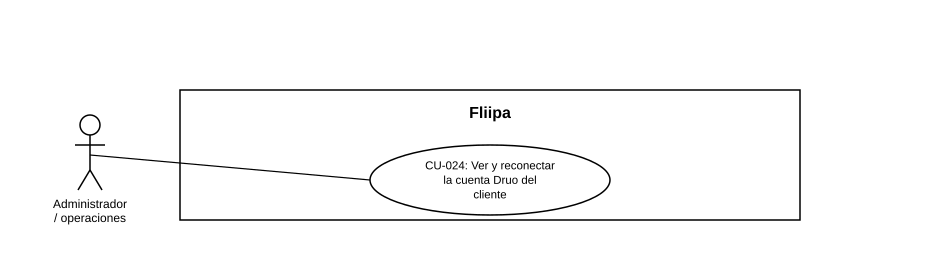

### CU-024: Ver y reconectar la cuenta Druo del cliente

| Campo | Detalle |
|---|---|
| **Actores** | Administrador / operaciones |
| **Descripción** | El administrador consulta el estado de la cuenta Druo (conexión bancaria) de un cliente y solicita la reconexión si hace falta, para desbloquear el onboarding o los cobros asociados. |
| **Precondiciones** | El cliente tiene o tuvo una cuenta bancaria conectada mediante Druo. |
| **Flujo principal** | 1. El administrador abre la ficha del cliente. 2. El sistema muestra el estado actual de la cuenta Druo. 3. Si la conexión está caída o vencida, el administrador inicia el proceso de conexión/reconexión. 4. El sistema ejecuta el proceso real con Druo y refleja el resultado obtenido. |
| **Flujos alternativos / excepciones** | A1. El proceso de reconexión falla: el sistema no simula un éxito falso; refleja el resultado real de Druo. |
| **Postcondiciones** | El administrador conoce el estado real de la cuenta Druo del cliente y, si aplicó, la reconexión queda reflejada según el resultado real del proceso. |
| **Reglas de negocio** | El resultado de la reconexión depende del proceso real con Druo; no debe simularse un éxito falso. |
| **Historias de usuario relacionadas** | [HU-040](../../Historias%20De%20Usuario/5.%20Operaci%C3%B3n%20admin/HU-040%20%20Ver%20y%20reconectar%20cuenta%20Dr%C3%BAo.md) (Ver y reconectar la cuenta Druo del cliente) *relacionada con:* [HU-014](../../Historias%20De%20Usuario/4.%20Cobranza/HU-014%20Debito%20autom%C3%A1tico%20de%20cr%C3%A9ditos%20vencidos.md) (débito automático, aún pendiente de punta a punta)|
| **Estado en plataforma** | Implementado. El flujo descrito (ver estado de la cuenta Druo, iniciar la reconexión y no simular un éxito falso) sí está disponible en el panel administrativo. |
| **Referencias** | Fuente: ficha  [HU-040](../../Historias%20De%20Usuario/5.%20Operaci%C3%B3n%20admin/HU-040%20%20Ver%20y%20reconectar%20cuenta%20Dr%C3%BAo.md) — *Historias de Usuario — Fliipa*, carpeta "6. Gestión Plataforma del admin" (repositorio `documentacion_fliipa`, María Fernanda Herazo). |
