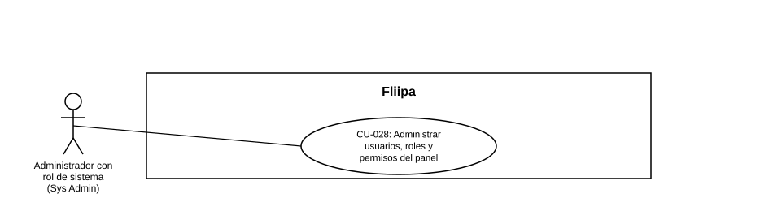

### CU-028: Administrar usuarios, roles y permisos del panel

| Campo | Detalle |
|---|---|
| **Actores** | Administrador con rol de sistema (Sys Admin) |
| **Descripción** | El administrador de sistema gestiona el ciclo de vida de los usuarios del panel administrativo: los crea, edita, elimina, les restablece la contraseña y les asigna uno de los 5 roles de panel (Sys Admin, Core Admin, Product Admin, Core Reader, Product Reader), cada uno con un conjunto distinto de permisos sobre las acciones del sistema. |
| **Precondiciones** | El usuario que ejecuta la acción tiene sesión activa en el panel con un rol elevado (Sys Admin, Core Admin o Product Admin, según la acción). |
| **Flujo principal** | 1. El administrador consulta el listado de usuarios del panel. 2. El administrador selecciona un usuario y consulta su detalle. 3. El administrador edita el nombre y/o correo del usuario, y/o le asigna un nuevo rol. 4. El sistema valida que el rol asignado sea uno de los 5 roles reconocidos; si no lo es, rechaza el cambio. 5. El sistema aplica el cambio y registra la acción en el log de auditoría del panel. |
| **Flujos alternativos / excepciones** | A1. El administrador restablece la contraseña de un usuario: el sistema genera una nueva contraseña y la retorna en texto plano para que el administrador la comunique de forma segura. A2. El administrador elimina un usuario: el sistema lo borra y registra la acción. A3. Un usuario consulta su propia actividad auditada: se le permite sin necesidad de un rol elevado. A4. Un usuario sin rol elevado intenta consultar la actividad de otro usuario: el sistema lo rechaza (403). A5. Cualquier operación de esta gestión falla (rol inválido, usuario no encontrado, etc.): el sistema registra igualmente el intento fallido en el log de auditoría. |
| **Postcondiciones** | El usuario del panel queda creado, editado, con nuevo rol, con contraseña restablecida o eliminado, según la acción ejecutada; el cambio (éxito o falla) queda trazado en el log de auditoría. |
| **Reglas de negocio** | Solo un rol elevado del panel (Sys Admin, Core Admin o Product Admin) puede gestionar usuarios distintos al propio. Todo usuario nuevo, si no se especifica rol, queda por defecto como Core Reader (rol de solo lectura más restringido). |
| **Historias de usuario relacionadas** | [HU-047](../../Historias%20De%20Usuario/5.%20Operaci%C3%B3n%20admin/HU-047%20Administrar%20usuarios%2C%20roles%20y%20permisos%20del%20panel.md) (Administrar usuarios, roles y permisos del panel administrativo) |
| **Estado en plataforma** | **Implementado.** Los endpoints de gestión de usuarios (`/users`, `/users/:id`, `/users/:id/role`, `/users/:id/details`, `/users/:id/reset-password`) existen y aplican auditoría en cada acción. |
| **Referencias** | Fuente: ficha [HU-047](../../Historias%20De%20Usuario/5.%20Operaci%C3%B3n%20admin/HU-047%20Administrar%20usuarios%2C%20roles%20y%20permisos%20del%20panel.md) y sección [Autorizaciones, Roles y Permisos](../../../Autorizacion Roles y Permiso/README.md) — *Historias de Usuario — Fliipa*, carpeta "5. Gestión Plataforma del admin" (repositorio `documentacion_fliipa`, María Fernanda Herazo). |
