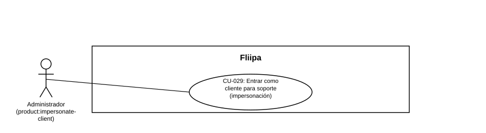

### CU-029: Entrar como cliente para soporte (impersonación)

| Campo | Detalle |
|---|---|
| **Actores** | Administrador con permiso `product:impersonate-client` |
| **Descripción** | El administrador inicia sesión en el portal del cliente (redemption) en representación de un cliente empresarial específico, sin necesidad de conocer su PIN, para brindarle soporte o verificar lo que el cliente ve en su propia sesión. |
| **Precondiciones** | El administrador tiene el permiso `product:impersonate-client` (rol Sys Admin o Product Admin). El cliente a impersonar tiene una línea de crédito en estado Aprobado o Activa. |
| **Flujo principal** | 1. El administrador solicita impersonar a un cliente específico desde el panel. 2. El sistema (admin) solicita internamente a `b2b` un token de intercambio para ese cliente. 3. `b2b` valida que el estado de la línea de crédito del cliente sea Aprobado o Activo. 4. `b2b` emite un token de intercambio de un solo propósito, válido por 60 segundos. 5. El sistema redirige al administrador al portal del cliente (redemption) con ese token. 6. Redemption intercambia el token por una sesión de cliente real, válida por 10 minutos y marcada como impersonada (incluye el correo y nombre del administrador). 7. El sistema registra la impersonación en el log de auditoría del panel. |
| **Flujos alternativos / excepciones** | A1. El cliente no tiene una línea de crédito Aprobada o Activa: la solicitud de impersonación se rechaza antes de emitir el token. A2. El token de intercambio expira (más de 60 segundos) o ya fue usado: el intercambio por sesión falla. A3. La solicitud de impersonación falla por cualquier motivo: el intento queda igualmente registrado en el log de auditoría. |
| **Postcondiciones** | El administrador queda con una sesión activa en el portal del cliente, limitada en el tiempo y marcada como impersonada; la acción queda registrada en el log de auditoría del panel. |
| **Reglas de negocio** | Solo se puede impersonar a clientes con línea de crédito Aprobada o Activa. El token de intercambio es de un solo propósito y de vida muy corta (60 segundos); la sesión resultante (10 minutos) es más corta que una sesión normal de cliente. |
| **Historias de usuario relacionadas** | [HU-048](../../Historias%20De%20Usuario/5.%20Operaci%C3%B3n%20admin/HU-048%20Entrar%20como%20cliente%20para%20soporte%20(impersonacion).md) (Entrar como cliente para soporte) |
| **Estado en plataforma** | **Implementado.** El flujo completo (admin → b2b → redemption) existe en el código. **Hallazgo:** la alerta operativa de cada impersonación está presente en el código pero comentada/deshabilitada; pendiente de confirmar con el equipo si debe reactivarse (ver [Autorizaciones, Roles y Permisos → 05](../../../Autorizacion Roles y Permiso/05 pendientes y riesgos.md)). |
| **Referencias** | Fuente: ficha [HU-048](../../Historias%20De%20Usuario/5.%20Operaci%C3%B3n%20admin/HU-048%20Entrar%20como%20cliente%20para%20soporte%20(impersonacion).md) y sección [Autorizaciones, Roles y Permisos → 04](../../../Autorizacion Roles y Permiso/04 impersonacion de clientes.md) — *Historias de Usuario — Fliipa*, carpeta "5. Operación admin" (repositorio `documentacion_fliipa`, María Fernanda Herazo). |