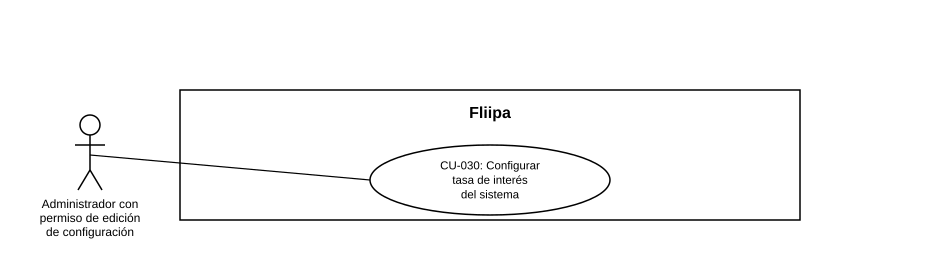

### CU-030: Configurar la tasa de interés del sistema

| Campo | Detalle |
|---|---|
| **Actores** | Administrador con permiso de edición de configuración (Sys Admin / Core Admin); cualquier administrador autenticado (consulta de solo lectura). |
| **Descripción** | El administrador consulta y, si tiene el permiso correspondiente, edita la tasa de interés diaria vigente y la tasa de interés por mora del sistema, que las calculadoras de crédito y de plan de pagos consumen en vivo. |
| **Precondiciones** | El administrador tiene sesión activa en el panel. Los settings `daily_interest_rate` y `overdue_interest_rate` ya existen (fueron sembrados previamente); el sistema no permite crear settings nuevos desde esta pantalla, solo editar el valor de los existentes. |
| **Flujo principal** | 1. El administrador entra a "Configuración" desde el menú lateral (sección Core). 2. El sistema muestra, entre otros settings, `daily_interest_rate` y `overdue_interest_rate` con su valor en formato JSON y su fecha de última actualización. 3. El administrador edita el valor JSON del setting que corresponda (por ejemplo, cambia `dailyInterestRate`). 4. El administrador presiona "Guardar". 5. El sistema valida en el navegador que el texto sea JSON válido; si lo es, envía la actualización al backend. 6. El backend actualiza el registro y responde con el nuevo valor. 7. El sistema refresca la vista mostrando el valor y la fecha de actualización más recientes. |
| **Flujos alternativos / excepciones** | A1. El administrador no tiene el permiso "Editar configuración": el campo de valor se muestra en modo solo lectura y el botón "Guardar" permanece deshabilitado. A2. El JSON ingresado es inválido: el sistema muestra la alerta "JSON inválido" y no envía la petición. A3. El nombre del setting no existe en el backend: el sistema responde 404 y no aplica el cambio. A4. No se envía un valor en la petición: el sistema responde 400 ("value is required"). |
| **Postcondiciones** | El valor de la tasa queda actualizado en la base de datos y es consumido de inmediato por los servicios que la leen en vivo (por ejemplo, `getRedemptionCreditSettings`, que calcula la tasa efectiva anual mostrada al cliente y el plan de pagos), sin necesidad de reiniciar ningún servicio. La acción (éxito o falla) queda registrada en el log de auditoría del panel. |
| **Reglas de negocio** | `daily_interest_rate` es la tasa diaria vigente aplicada a cartera al día; `overdue_interest_rate` es la tasa diaria de mora aplicada a cartera vencida. Ambas son la base directa del cálculo de intereses y de la tasa efectiva anual mostrada al cliente. Toda modificación exitosa o fallida queda registrada en auditoría. |
| **Historias de usuario relacionadas** | [HU-049](../../Historias%20De%20Usuario/5.%20Operaci%C3%B3n%20admin/HU-049%20configurar%20la%20tasa%20de%20interes%20del%20sistema.md) (Configurar la tasa de interés del sistema) |
| **Estado en plataforma** | **Implementado.** `GET /settings` y `PUT /settings/:name` (`settings.controller.ts`, `settings.service.ts`) están activos y la pantalla `apps/admin/src/app/settings/page.tsx` los consume. **Hallazgo técnico:** la ruta `PUT /settings/:name` solo exige `authenticate`; no aplica ningún middleware de permisos en el backend, por lo que el control de quién puede editar (permiso `core:update-setting`) hoy solo existe en el frontend. Se recomienda reforzar esta validación también del lado del servidor, dado que la tasa de interés afecta directamente el costo del crédito para todos los clientes activos. |
| **Referencias** | Fuente: ficha [HU-049](../../Historias%20De%20Usuario/5.%20Operaci%C3%B3n%20admin/HU-049%20configurar%20la%20tasa%20de%20interes%20del%20sistema.md) — *Historias de Usuario — Fliipa*, carpeta "5. Operación admin" (repositorio `documentacion_fliipa`, María Fernanda Herazo). Caso de uso de numeración nueva (`CU-030`), agregado en esta revisión para cubrir la edición de la tasa de interés desde la pantalla "Configuración" del panel admin, separado de fechas de corte (CU-031) y del resto de parámetros (CU-032) por su criticidad financiera propia. |