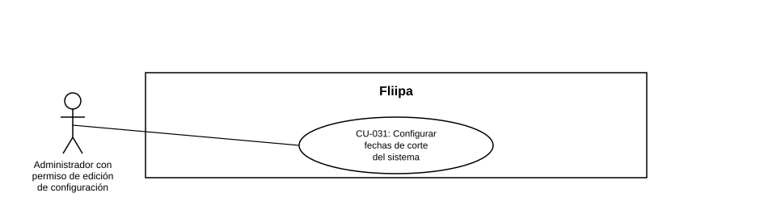

### CU-031: Ver y asignar bonos D1 a clientes

| Campo | Detalle |
|---|---|
| **Actores** | Administrador del producto |
| **Descripción** | El administrador consulta el listado de bonos (cupones) D1, crea un bono individual o importa varios de forma masiva por CSV, vinculando cada bono a un cliente producto existente, y consulta el detalle de un bono con su historial de compras, pudiendo registrar manualmente una compra contra él. |
| **Precondiciones** | El administrador tiene sesión activa en el panel. Para crear o importar un bono, el documento indicado debe corresponder a exactamente un cliente producto ya existente en la plataforma. |
| **Flujo principal (alta individual)** | 1. El administrador entra a "Bonos D1" desde el menú lateral (sección Producto) y abre la pestaña "Crear bono". 2. El administrador ingresa código, monto, fecha de expiración y documento del cliente. 3. El sistema busca el cliente por documento en tiempo real y muestra su nombre si lo encuentra. 4. El administrador confirma la creación. 5. El sistema valida código y documento no vacíos, monto numérico no negativo y fecha de expiración válida. 6. El sistema valida que el documento corresponda a un único cliente producto existente. 7. El sistema crea el bono vinculado a ese cliente y muestra la confirmación con el código, el monto y el cliente asignado. |
| **Flujos alternativos / excepciones** | A1. Importación masiva: el administrador carga un CSV con las columnas `codigo, monto, fecha_expiracion, documento`; el sistema lo procesa por lotes y reporta filas procesadas, bonos creados, duplicados omitidos e inválidos omitidos. A2. El documento no corresponde a ningún cliente, o corresponde a más de uno: el sistema rechaza la creación del bono (individual o en la fila del CSV correspondiente). A3. Consulta de detalle: el administrador abre un bono desde el listado y ve su estado (asignado o expirado), monto, valor utilizado, fecha de expiración, cliente vinculado y compras registradas. A4. Registro manual de compra: desde el detalle del bono, el administrador indica un monto mayor a cero y el sistema registra una compra con origen "admin", sumándose al valor utilizado del bono. |
| **Postcondiciones** | El bono queda creado (o importado) y vinculado a un cliente, disponible para ser usado como cupo adicional en tienda D1; si se registró una compra manual, el valor utilizado del bono queda actualizado. |
| **Reglas de negocio** | Un bono siempre debe quedar vinculado a un cliente producto existente al momento de crearse (no se permite crear bonos "sin dueño"). El código de cada bono debe ser único. La fecha de expiración es obligatoria y determina si el bono aparece como "expirado" en el detalle. Las compras contra un bono pueden originarse desde el panel admin (`admin`) o desde un webhook externo (`webhook`). |
| **Historias de usuario relacionadas** | [HU-050](../../Historias%20De%20Usuario/5.%20Operaci%C3%B3n%20admin/HU-050%20Ver%2C%20crear%20e%20importar%20bonos%20D1%20para%20clientes.md) (Ver, crear e importar bonos D1 para clientes) |
| **Estado en plataforma** | **Implementado** en el frontend (`apps/admin/src/app/product/bonos-d1`) y en el backend `b2b` (`coupons.controller.ts`, `coupons.service.ts`). **Hallazgo técnico crítico:** las rutas `GET /coupons`, `POST /coupons`, `POST /coupons/import`, `GET /coupons/:id` y `POST /coupons/:id/purchases` en `backends/b2b/src/routes.ts` no tienen middleware de autenticación ni de permisos aplicado, a diferencia de la mayoría de rutas administrativas del sistema. Se recomienda agregar autenticación y control de permisos a estas rutas antes de considerar el módulo listo para producción. |
| **Referencias** | Fuente: ficha [HU-050](../../Historias%20De%20Usuario/5.%20Operaci%C3%B3n%20admin/HU-050%20Ver%2C%20crear%20e%20importar%20bonos%20D1%20para%20clientes.md) — *Historias de Usuario — Fliipa*, carpeta "5. Gestión Plataforma del admin" (repositorio `documentacion_fliipa`, María Fernanda Herazo). Caso de uso de numeración nueva (`CU-031`), agregado en esta revisión para cubrir la pantalla "Bonos D1" del panel admin, que no tenía documentación previa. |