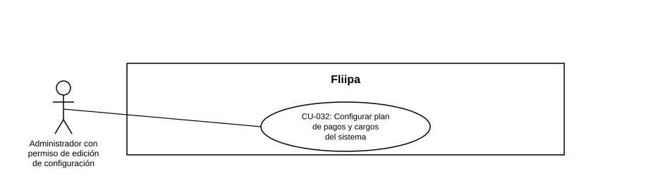

### CU-032: Configurar el plan de pagos y los cargos del sistema

| Campo | Detalle |
|---|---|
| **Actores** | Administrador con permiso de edición de configuración (Sys Admin / Core Admin); cualquier administrador autenticado (consulta de solo lectura). |
| **Descripción** | El administrador consulta y, si tiene el permiso correspondiente, edita la configuración del plan de pagos (periodos, días de vencimiento, tasas de interés/administración/seguro, otros cobros) y el listado de cargos aplicables al crédito (fijos o por tasa, corrientes o de mora), que las calculadoras de crédito consumen en vivo. |
| **Precondiciones** | El administrador tiene sesión activa en el panel. Los settings `payment_plan_config` y `payment_charges` ya existen (fueron sembrados previamente); el sistema no permite crear settings nuevos desde esta pantalla, solo editar el valor de los existentes. |
| **Flujo principal** | 1. El administrador entra a "Configuración" desde el menú lateral (sección Core). 2. El sistema muestra los settings `payment_plan_config` y `payment_charges` con su valor en formato JSON y su fecha de última actualización. 3. El administrador edita el valor JSON del setting que corresponda (por ejemplo, agrega un nuevo cargo en `paymentCharges` o cambia `periods` en el plan de pagos). 4. El administrador presiona "Guardar". 5. El sistema valida en el navegador que el texto sea JSON válido; si lo es, envía la actualización al backend. 6. El backend actualiza el registro y responde con el nuevo valor. 7. El sistema refresca la vista mostrando el valor y la fecha de actualización más recientes. |
| **Flujos alternativos / excepciones** | A1. El administrador no tiene el permiso "Editar configuración": el campo de valor se muestra en modo solo lectura y el botón "Guardar" permanece deshabilitado. A2. El JSON ingresado es inválido: el sistema muestra la alerta "JSON inválido" y no envía la petición. A3. El nombre del setting no existe en el backend: el sistema responde 404 y no aplica el cambio. A4. No se envía un valor en la petición: el sistema responde 400 ("value is required"). |
| **Postcondiciones** | El valor del setting queda actualizado en la base de datos y es consumido de inmediato por los servicios que lo leen en vivo (por ejemplo, `getRedemptionCreditSettings`, que arma el plan de pagos y aplica los cargos correspondientes), sin necesidad de reiniciar ningún servicio. La acción (éxito o falla) queda registrada en el log de auditoría del panel. |
| **Reglas de negocio** | `payment_plan_config` define la estructura base del plan de pagos: número de periodos, días de vencimiento del pago, tasa de interés, tasa administrativa, tasa de seguro y otros cobros. `payment_charges` define la lista de cargos individuales que pueden aplicarse, cada uno con prioridad, tipo (fijo o por tasa), base de cálculo de la tasa, periodicidad (diario, mensual o único) y si aplica a cartera corriente o vencida. Toda modificación exitosa o fallida queda registrada en auditoría. |
| **Historias de usuario relacionadas** | [HU-051](../../Historias%20De%20Usuario/5.%20Operaci%C3%B3n%20admin/HU-051%20configurar%20el%20plan%20de%20pagos%20y%20los%20cargos%20del%20sistema.md) (Configurar el plan de pagos y los cargos del sistema) |
| **Estado en plataforma** | **Implementado.** `GET /settings` y `PUT /settings/:name` (`settings.controller.ts`, `settings.service.ts`) están activos y la pantalla `apps/admin/src/app/settings/page.tsx` los consume. **Hallazgo técnico:** igual que en CU-030 y CU-031, la ruta `PUT /settings/:name` solo exige `authenticate` en el backend, sin validar el permiso `core:update-setting` a nivel de API. Se recomienda reforzar esta validación también del lado del servidor, dado que estos parámetros determinan directamente cuánto paga cada cliente por su crédito. |
| **Referencias** | Fuente: ficha [HU-051](../../Historias%20De%20Usuario/5.%20Operaci%C3%B3n%20admin/HU-051%20configurar%20el%20plan%20de%20pagos%20y%20los%20cargos%20del%20sistema.md) — *Historias de Usuario — Fliipa*, carpeta "5. Operación admin" (repositorio `documentacion_fliipa`, María Fernanda Herazo). Caso de uso de numeración nueva (`CU-032`), agregado en esta revisión para cubrir la edición del plan de pagos y los cargos desde la pantalla "Configuración" del panel admin, separado de la tasa de interés (CU-030) y las fechas de corte (CU-031). |