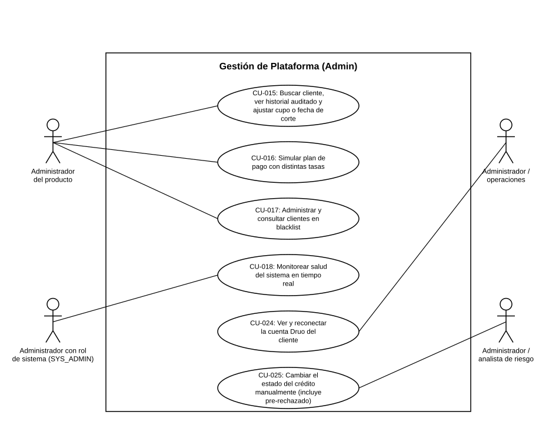

# Diagrama de Casos de Uso — Gestión de Plataforma (Admin)

**Actores del capítulo:** Administrador del producto, Administrador con rol de sistema (SYS_ADMIN), Administrador / operaciones, Administrador / analista de riesgo

**Casos de uso incluidos:**

- [CU-015](CU-015 Buscar cliente, ver historial auditado y ajustar cupo o fecha de corte.md)
- [CU-016](CU-016 Simular plan de pago con distintas tasas.md)
- [CU-017](CU-017 Administrar y consultar clientes en blacklist.md)
- [CU-018](CU-018 Monitorear salud del sistema en tiempo real.md)
- [CU-024](CU-024 Ver y reconectar la cuenta Druo del cliente.md)
- [CU-025](CU-025%20Cambiar%20el%20estado%20del%20credito%20manualmente%20%28incluye%20pre-rechazado%29.md).md)

> Diagrama UML de casos de uso generado a partir de las fichas de este capítulo (ver `README.md` del proyecto para la tabla de correspondencia Historias de Usuario → Casos de Uso).
