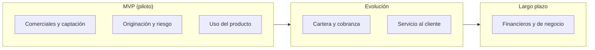

# Indicadores

| Documento | Indicadores |
|-----------|-------------|
| **Proyecto** | Flipa |
| **Versión** | 2.1|
| **Estado** | Borrador para validación |
| **Responsable** | Negocio y operaciones |
| **Última actualización** | 2026-07-30 |

---

## Control de versiones

| Versión | Fecha | Autor | Descripción |
|---------|-------|-------|-------------|
| 0.1 – 1.1 | 2026-07-06 a 2026-07-14 | María Fernanda Herazo  | Historial completo en el `indicadores.md` original (monolítico): primera versión de los indicadores de negocio y corrección posterior tras el Weekly Sync de Producto (10 jul 2026), que agregó la clasificación por horizonte (MVP, Evolución, Largo plazo). |
| 2.0 | 2026-07-14 | María Fernanda Herazo | Reorganización: un archivo por categoría de indicador, siguiendo el mismo formato usado en [Actores](../Actores/README.md) y [Procesos](../../Operaciones/Procesos/README.md). Se agregan diagramas Mermaid: horizonte de indicadores, embudo comercial y flujo de buckets de cartera. |
| 2.1 | 2026-07-30 | María Fernanda Herazo | Ajuste de SLA de aprobación de 72h a 24h y reemplazo de "tenderos" por "clientes"/"micronegocios", consistente con el Check-in de Producto (15 jul 2026). Se agregan las metas de éxito del piloto acordadas en esa misma reunión (300 créditos desembolsados, tasa de incumplimiento ≤10%, originación automatizada en menos de 1 día), que hasta ahora no estaban documentadas en esta carpeta. |

---

## Objetivo

Definir los indicadores clave (KPIs) que permiten medir el desempeño comercial, de riesgo, de cartera y de servicio del negocio Flipa, para apoyar la toma de decisiones del Comité de Cartera, del equipo comercial y del negocio en general.

## Alcance

Este documento cubre indicadores comerciales, de originación y riesgo, de cartera y cobranza, de uso del producto, de servicio al cliente, y financieros/de negocio. No define las metas de negocio de más alto nivel (ver [Objetivo del Producto](../../Producto/objetivo.md)) ni las reglas que determinan cada estado de mora (ver [Reglas Negocio](../../README.md)).

## Diagrama: indicadores por horizonte

Siguiendo lo acordado en el Weekly Sync de Producto (10 jul 2026), las categorías de indicadores se ubican en tres horizontes, para no duplicar objetivos entre etapas:

## Indicadores de éxito del piloto

> **Nota (Check-in de Producto, 15 jul 2026):** estos tres indicadores se acordaron explícitamente como las metas que determinan el éxito del piloto, separadas del resto de métricas de seguimiento. No deben confundirse con indicadores de servicios de terceros (p. ej. biometría), que no se clasifican como indicadores de éxito internos.

| Indicador | Meta | Horizonte |
|---|---|---|
| Créditos desembolsados | 300 | MVP |
| Tasa de incumplimiento (default) | ≤ 10% | MVP |
| Originación automatizada del crédito | < 1 día | MVP |

> ⚠️ **Dato por confirmar:** el Weekly Planning de Producto (27 jul 2026) menciona un piloto proyectado de ~500 clientes activos y ~3.000 créditos totales, cifra distinta a la meta de 300 créditos acordada el 15 jul. Confirmar con el dueño del proceso cuál es la meta vigente antes de presentar este documento.

## Categorías de indicadores

| # | Categoría | Horizonte | Resumen | Documento |
|---|-----------|-----------|---------|-----------|
| 1 | Comerciales y de captación | MVP | Tasa de respuesta por canal, conversión, clientes activados en el piloto (300 clientes/micronegocios*), seguimiento a primera compra. | [./01 Comerciales Captacion.md](./01 Comerciales Captacion.md) |
| 2 | Originación y riesgo | MVP | SLA de aprobación (24h*), tasa de aprobación/rechazo, casos de biometría en revisión, duración del onboarding. | [./02 Originacion Riesgo.md](./02 Originacion Riesgo.md) |
| 3 | Cartera y cobranza | Evolución | Distribución por bucket, PAR, tasa de recuperación, castigo de cartera, casos priorizados por el Comité de Cartera. | [./03 Cartera Cobranza.md](./03 Cartera Cobranza.md) |
| 4 | Uso del producto | MVP | % de uso del cupo, tiempo al primer uso, tasa de renovación, ticket promedio. | [./04 Uso Producto.md](./04 Uso Producto.md) |
| 5 | Servicio al cliente | Evolución | % resuelto por IA, tiempo de resolución, NPS/CSAT, SLA de PQR. | [./05 Servicio Cliente.md](./05 Servicio Cliente.md) |
| 6 | Financieros y de negocio | Largo plazo | Costo de fondeo (GMF 4x1000), sostenibilidad financiera, información crediticia generada. | [./06 Financieros Negocio.md](./06 Financieros Negocio.md) |
| — | Pendientes | — | Metas numéricas y periodicidad de reporte todavía por definir. | [./07 Pendientes.md](./07 Pendientes.md) |

> \* **Dato sujeto a cambios frecuentes** (Check-in de Producto, 15 jul 2026): el SLA de aprobación y la meta piloto son parámetros operativos que pueden ajustarse conforme evolucione el producto. Confirmar la versión vigente con el dueño del proceso antes de citarlos en otro documento.

## Documentos relacionados

- [Negocio](../../README.md)
- [Flipa - Biblioteca de Conocimiento](../../README.md)
- [Mapa Del Conocimiento](../../README.md)
- [Onboarding](../../README.md)
- [Convenciones](../../README.md)
- [Producto](../../Producto/alcance.md)
- [Funcional](../../README.md)
- [Qa](../../README.md)
- [Descripcion Negocio](../../README.md)
- [Actores](../Actores/README.md)
- [Procesos](../../Operaciones/Procesos/README.md)
- [Reglas Negocio](../../README.md)

## Fuentes consultadas

- Objetivo del Producto (`Producto/objetivo.md`)
- Alcance del Producto (`Producto/alcance.md`)
- Modelo Comercial B2B — *Modelo Comercial B2B.pptx*
- Modelo y Proceso de Cobranza B2B — *Modelo Cobranza/Modelo_de_Cobranza_B2B_.pptx* y *Modelo Cobranza/Modelo y gestion de cobranza.docx*
- Reglas Negocio (`negocio/reglas-negocio/README.md`)
- Journeys Colpatria B2B, junio 2026 — *Journeys Fran finales-1.pdf*
- Notas de la reunión "Producto: Weekly Sync" (10 jul 2026) y su transcripción asociada
- Notas de la reunión "Producto: Check-in" (15 jul 2026) y su transcripción asociada — ajuste de SLA 72h→24h, reemplazo de "tenderos", metas de éxito del piloto
- Notas de la reunión "Producto: Weekly Planning" (27 jul 2026) y su transcripción asociada — cifra de piloto (500 clientes / 3.000 créditos) pendiente de conciliar con la meta de 300 créditos
