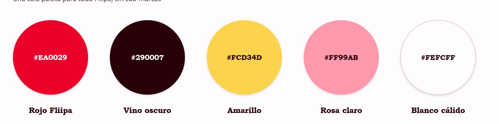

# Estrategia Comercial B2B
### Fliipa × D1 × Cliente — Socios D1

*Captación, originación y activación del crédito rotativo B2B*
Agosto 2026 · Documento confidencial

---

## Tabla de contenidos

1. [Resumen ejecutivo](#resumen-ejecutivo)
2. [El ecosistema: Fliipa × D1 × Cliente](#el-ecosistema-fliipa--d1--cliente)
3. [Identidad y tono de la marca comercial](#identidad-y-tono-de-la-marca-comercial)
4. [Captación comercial](#captación-comercial)
5. [Experiencia digital: portal del cliente](#experiencia-digital-portal-del-cliente)
6. [Hoja de ruta del piloto](#hoja-de-ruta-del-piloto)
7. [Anexo: preguntas frecuentes del producto](#anexo-preguntas-frecuentes-del-producto)

---

## Resumen ejecutivo

Fliipa es una fintech B2B de crédito para empresas — específicamente, el piloto actual opera bajo la marca "Socios D1", dirigido a clientes preaprobados que compran recurrentemente en tiendas D1.

El cliente de Fliipa es la empresa (pyme/microempresa).
Fliipa otorga un cupo de crédito preaprobado (ej. $500.000 - $1.000.000).
El cupo solo se usa en tiendas D1, con un código numérico único que llega por correo tras la aprobación.
El código sirve para una sola compra. Si el cliente usa menos del cupo total, el saldo restante queda congelado hasta que pague lo que usó.
El pago es siempre a 1 sola cuota, a 30 días — no hay plazos ni cuotas múltiples.
Al pagar completo, el cliente puede volver a solicitar un cupo nuevo.
La solicitud se hace con el NIT o CC.
Fliipa responde la solicitud en máximo 24 horas.

La estrategia se apoya en tres pilares:
1) Un mensaje comercial simple y sin tecnicismos, construido sobre el mix de arquetipos "Persona Corriente – Héroe".
2) Un proceso de originación ágil, con aprobación en máximo 24 horas y firma digital desde WhatsApp.
3) Una hoja de ruta de piloto que permite medir tasa de respuesta por canal y tasa de conversión antes de escalar.

---

## El ecosistema: Fliipa × D1 × Cliente

El negocio comercial se sostiene sobre tres actores que conforman un ecosistema de crédito B2B de bajo riesgo:

- **Fliipa:** plataforma financiera que origina y gestiona el crédito rotativo B2B. Evalúa con datos de consumo real, no solo con historial bancario.
- **D1:** la cadena de descuento más grande de Colombia, con más de 3.000 tiendas y millones de clientes que compran semanalmente.
- **Cliente:** el pequeño comercio con alta frecuencia de compra en D1, que necesita flujo de caja flexible para surtir su negocio sin descapitalizarse.

*Fuente: Modelo Comercial B2B.pptx (sumz.co)*

### ¿Qué es el crédito Fliipa?

Un cupo rotativo preaprobado para comprar en D1 y pagar en una sola cuota diferida, sin salir de caja. Los atributos comerciales clave que se comunican al cliente son:

- Cupo preaprobado por cliente, calculado con base en su comportamiento de compra en D1.
- Pago diferido en una cuota (30 días), sin necesidad de desembolsar efectivo de inmediato.
- Aprobación máxima en 24 horas.
- El cupo se bloquea ante retrasos de pago y se reporta a centrales de riesgo según los plazos legales  este punto se comunica con transparencia, nunca como amenaza.

*Fuente: Modelo Comercial B2B.pptx y Speech_Ofrecimiento_Fliipa.docx*

### Propuesta de valor para el cliente

| Beneficio | Qué significa para el tendero |
|---|---|
| Surtido sin descapitalizarse | Puede comprar más seguido en D1 sin usar todo su efectivo de una sola vez. |
| Cuotas predecibles | Sabe exactamente cuánto va a pagar y cuándo. Sin sorpresas. |
| Construye historial | Cada pago a tiempo fortalece el perfil crediticio de su negocio. |
| Más cupo con el tiempo | Si paga bien y usa el cupo, el monto puede crecer automáticamente. |
| Sin banco ni codeudor | No depende de historial bancario tradicional; se evalúa por su comportamiento en D1. |
| Acceso digital fácil | Todo se gestiona por WhatsApp, sin papelería, filas ni oficinas. |

*Fuente: Modelo Comercial B2B.pptx (sumz.co)*

---

## Identidad y tono de la marca comercial
Fliipa no se posiciona como una entidad financiera tradicional, sino como un aliado cercano del microempresario. Acompaña al cliente en el día a día de su negocio, habla su mismo lenguaje y busca construir una relación de confianza a largo plazo, más allá de una transacción puntual de crédito.
Esta identidad se construye a partir de la combinación de dos arquetipos:
Persona Corriente: representa la cercanía, la igualdad y el trato justo. Fliipa se presenta como un aliado estratégico que entiende lo que significa sostener un negocio día a día y construye una relación cercana, transparente y de confianza. Su voz es amigable y cálida.

Héroe: representa el éxito, la superación y el crecimiento del cliente. Fliipa no busca “rescatar” al microempresario, sino brindarle las herramientas, como el crédito, para que pueda resolver sus necesidades de liquidez y hacer crecer su negocio. Su voz es directa, honesta y motivadora.

La combinación de ambos arquetipos, denominada “Héroe Corriente”, se traduce en una promesa concreta: Fliipa habla como un aliado cercano que entiende el negocio del cliente y actúa con la determinación necesaria para impulsar su crecimiento.
Esto se refleja en todo el ciclo del producto: desde comunicaciones comerciales cercanas y sin tecnicismos, hasta el acompañamiento humano por chat o llamada durante la originación y el servicio al cliente. Además, la evaluación del crédito considera el comportamiento real del negocio, buscando ofrecer oportunidades que los criterios bancarios tradicionales podrían limitar.

##  VALORES Y CULTURA

Los valores de Fliipa son:

**Cercanía · Simplicidad · Lealtad · Impacto**

| Valor | Qué significa |
|---|---|
| **Cercanía** | Visitamos el negocio, conocemos al cliente y damos la cara. Somos un socio presente, no una entidad lejana. |
| **Simplicidad** | Hablamos claro y sin jerga. Si el cliente no entiende el crédito, el problema es nuestro, no de él. |
| **Lealtad** | Confiamos en el esfuerzo del cliente y lo acompañamos incluso en las dificultades. |
| **Impacto** | Pensamos a largo plazo: buscamos que el negocio del cliente supere la barrera de los 5 años. |

### Reglas de lenguaje comercial

Para mantener un tono conversacional y cercano, el equipo comercial evita tecnicismos financieros y sustituye el lenguaje bancario por expresiones que el cliente reconoce como propias de su negocio:

| Evitar | Usar |
|---|---|
| Representante legal | Aliado comercial |
| Capital de trabajo | Recursos de liquidez |
| Crédito rotativo / línea de financiamiento | Cupo que se renueva al pagar |
| Verificar / evaluar el negocio | Conocer y acompañar el negocio |

*Fuente: Speech_Ofrecimiento_Fliipa.docx y Arquetipos.docx*

---

## Captación comercial

La captación se activa de forma simultánea por tres canales, con un mismo mensaje central: el cliente responde por el canal que le resulte más natural.

| Canal | Rol | Tono |
|---|---|---|
| Email | Primer contacto formal. Informa el cupo preaprobado y el link de solicitud. | Informativo |
| WhatsApp | Canal principal. Envío de enlace, seguimiento y soporte en tiempo real. | Cercano, directo |
| Llamada | Speech comercial: presentación del beneficio, manejo de objeciones y cierre. | Conversacional |

Una vez el cliente muestra interés, toda la interacción migra a WhatsApp, que es el canal donde vive el tendero y donde se concentra la originación.

*Fuente: Modelo Comercial B2B.pptx (sumz.co)*

### Principios de la llamada comercial

Antes de ejecutar el speech, el equipo comercial interioriza reglas no negociables que garantizan una conversación natural y efectiva:

- Es una conversación, no un guion: se habla como quien cuenta algo bueno a un conocido.
- Cero tecnicismos: se evitan términos como "crédito rotativo" o "representante legal" a menos que el cliente pregunte.
- Se afirma, no se pregunta: en lugar de "¿le interesa?", se usa "cuéntame qué te parece".
- El asesor ya conoce al cliente: se usan los datos disponibles del negocio para generar confianza, sin preguntar lo que ya se sabe.
- El monto se comunica a la mitad de la llamada, una vez el cliente está enganchado — nunca al abrir la conversación.
- La visita no es una auditoría: se posiciona como una oportunidad para "conocer" y "acompañar" el negocio, nunca para "verificar" o "evaluar".
- WhatsApp es el canal de gestión: todo el proceso posterior a la llamada se mueve a WhatsApp.

*Fuente: Speech_Ofrecimiento_Fliipa.docx (Guía de Ofrecimiento Comercial, sumz.co)*

#### Estructura del speech de llamada

| Momento | Objetivo |
|---|---|
| Apertura | Generar cercanía y reconocer al cliente como comprador frecuente de D1. |
| La propuesta | Comunicar el cupo preaprobado y el plazo de pago, ya con el cliente enganchado. |
| Las condiciones | Explicar el funcionamiento del cupo solo si el cliente muestra interés. |
| El proceso | Explicar los pasos de solicitud por WhatsApp y confirmar datos de contacto. |
| Cierre | Agradecer y reforzar que el cliente recibió un reconocimiento, no una venta. |

*Fuente: Speech_Ofrecimiento_Fliipa.docx*

#### Manejo de objeciones frecuentes

| Objeción | Enfoque de respuesta |
|---|---|
| "No me interesa" / "No tengo tiempo" | Buscar otro espacio según disponibilidad antes de cerrar; enviar la información por WhatsApp igualmente. |
| "¿Cómo consiguieron mi número?" | Explicar que hace parte de la base de clientes frecuentes de D1 y que por eso califica para la campaña. |
| "¿Esto es como un banco?" | Aclarar que son aliados de D1, sin codeudor ni garantías; es un beneficio por buen comportamiento de compra. |
| "¿Y si me atraso?" | Explicar que primero se contacta al cliente para entender la situación y buscar una solución, antes que aplicar sanciones. |
| "Estoy bien así, no necesito crédito" | Reposicionar el cupo como un reconocimiento a la fidelidad, no como una necesidad. |
| "Déjame pensarlo" | Enviar la información por WhatsApp y mencionar la vigencia limitada de la campaña. |

*Fuente: Speech_Ofrecimiento_Fliipa.docx*

---

## Experiencia digital: portal del cliente

El cliente no visita una oficina: todo el proceso de originación sucede desde su celular, en seis pasos.

| Paso | Acción |
|---|---|
| 1. Recibe enlace | Por WhatsApp, al número confirmado durante la llamada. |
| 2. Ingresa con NIT | Del negocio y datos del representante legal. |
| 3. Verifica identidad | Foto de cédula y selfie; KYC automático. |
| 4. Vincula cuenta | Débito automático mediante Druo. |
| 5. Firma contrato | Firma digital, desde el celular, en minutos. |
| 6. Usa su cupo | Código numérico para canjear en cualquier tienda D1. |

*Fuente: Modelo Comercial B2B.pptx (sumz.co)*

---

## Hoja de ruta del piloto

El piloto B2B se activa en seis etapas, con foco en validar canales antes de escalar la base completa de clientes preaprobados.

| Etapa | Descripción |
|---|---|
| 1. Validar base de datos | Confirmar la lista de clientes preaprobados y sus datos de contacto. |
| 2. Activar canales | Configurar plantillas de WhatsApp, email y el speech de llamada con Fliipa. |
| 3. Lanzar piloto | Contactar a los primeros 300 cliente y medir la tasa de respuesta por canal. |
| 4. Acompañar originación | Un asesor comercial acompaña a los negocios seleccionados en el KYC y la firma del contrato. |
| 5. Seguimiento primera compra | El asesor contacta a los clientes aprobados que no han usado el cupo en 7 días. |
| 6. Analizar y escalar | Se mide el canal más efectivo, el tipo de negocio, la tasa de conversión y de uso. |

*Fuente: Modelo Comercial B2B.pptx (sumz.co)*
## Paleta de colores

---

## Anexo: preguntas frecuentes del producto

### Producto y cupo

| Pregunta | Respuesta |
|---|---|
| ¿Quién puede acceder al crédito? | Pequeños comercios y empresas con relación comercial activa en D1 y comportamiento de compra evaluado positivamente por el modelo de riesgo. |
| ¿Cómo se define el monto del cupo? | Con base en el comportamiento de compra, la recurrencia, la capacidad de pago y variables internas de riesgo — no depende únicamente del historial bancario. |
| ¿El cupo puede cambiar? | Sí, puede ajustarse según el comportamiento de pago y el uso del crédito. |
| ¿Puedo usar el cupo parcialmente? | No; el cupo aprobado se destina a una única compra. Al pagarla, el cupo se habilita nuevamente. |

### Pagos, mora y transparencia

| Pregunta | Respuesta |
|---|---|
| ¿En cuántas cuotas se paga? | El crédito se paga en una sola cuota. |
| ¿Envían recordatorios de pago? | Sí, se envían comunicaciones previas al vencimiento por WhatsApp y los canales autorizados. |
| ¿Reportan a centrales de riesgo? | Sí; si la obligación no se normaliza en los plazos legales, se reporta a Datacrédito y demás centrales de información financiera. |
| ¿Puedo negociar si tengo un atraso? | Sí; según el estado de mora y el comportamiento previo, pueden evaluarse alivios o acuerdos de pago. |
| ¿Quién es Fliipa? | La empresa aliada de D1 que administra y gestiona el crédito bajo un modelo estructurado de riesgo y cobranza, operando bajo la marca Socios D1. |

*Fuente: Speech_Ofrecimiento_Fliipa.docx (Preguntas Frecuentes — Producto, sumz.co)*

---
*sumz.co · Documento confidencial*
