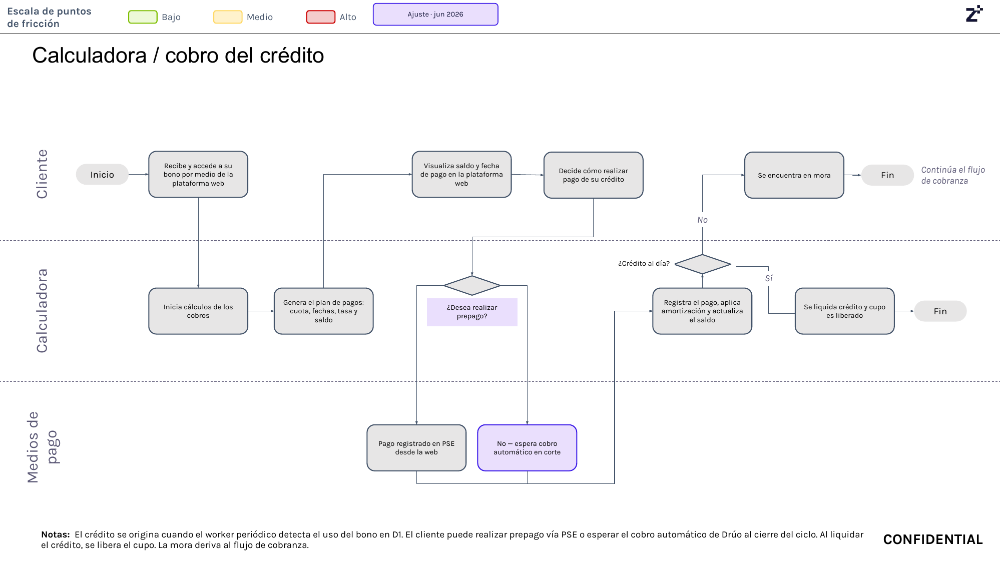

# 4. Calculadora y cobro del crédito

## Objetivo

Administrar el ciclo de pago del crédito una vez el cliente utiliza el bono D1, calculando automáticamente el plan de pagos, permitiendo realizar pagos anticipados o esperar el débito automático, actualizando el saldo del crédito y determinando si la obligación queda al día, se liquida completamente o continúa hacia el proceso de cobranza.

---

## Journey

**Figura 6. Journey de Calculadora y Cobro del Crédito.**

El journey se organiza en tres carriles (swimlanes): **Cliente**, **Calculadora** y **Medios de pago**. La caja "No — espera cobro automático en corte" está marcada como ajuste de junio de 2026.

> **⚠️ Pendiente de sincronizar:** el diagrama del journey (página 7) aún no refleja las alertas de Slack que se agregan en esta versión del documento (mora, error de actualización de saldo y falla del débito automático). Se recomienda actualizar la figura por separado para que quede consistente con el texto.

*Los elementos marcados con asterisco (\*) corresponden a puntos aún no definidos técnicamente o pendientes de confirmación con el dueño del proceso; se detallan en cada paso y se listan de forma consolidada en "Pendientes de validación".*

---

## Descripción general

Una vez el cliente recibe y accede a su bono D1 (asignado en el paso 16 del proceso de Firma de Contrato, documento 4) y lo utiliza para realizar una compra, un **worker periódico**\* detecta ese uso en D1 y dispara el inicio de los cálculos de cobro. La calculadora genera automáticamente el plan de pagos (cuotas, fechas, tasa y saldo inicial), información que el cliente puede consultar desde la plataforma web.

El cliente decide entonces si desea realizar un prepago mediante PSE desde la web, o esperar el cobro automático que se ejecuta con Drúo al cierre del ciclo. Una vez recibido el pago, el sistema lo registra, aplica la amortización correspondiente y actualiza el saldo. Si el crédito queda al día, se liquida y el cupo se libera para un nuevo ciclo; si el cliente se encuentra en mora, el caso continúa automáticamente hacia el proceso de Cobranza (documento 8).

En consistencia con el estándar de trazabilidad definido para el ciclo del crédito (documento 4), el sistema notifica por Slack al equipo de operaciones los eventos relevantes de este proceso —falla del débito automático con Drúo, error durante la actualización del saldo, y todo caso en que el crédito quede en mora—, incluyendo en cada alerta un **enlace directo al caso en el panel de administración**.

---

## Explicación paso a paso

Cada paso incluye el **proceso** (qué ocurre técnica u operativamente) y un **tiempo estimado** de referencia, pendiente de validar con Producto/Tecnología.

### 1. Recepción y acceso al bono

**Actor:** Cliente.

**Proceso:** El cliente recibe y accede a su bono D1 por medio de la plataforma web (bono asignado en el paso 16 del documento 4, Firma de contrato y activación). Posteriormente utiliza el bono para realizar una compra en una tienda D1 (documento 6, Dispersión de fondos).

**Resultado:** Bono utilizado en una compra en D1.

**Tiempo estimado:** Depende de cuándo el cliente decida usar el bono; no es un tiempo fijo del sistema.

---

### 2. Detección del uso del bono e inicio de cálculos

**Actor:** Calculadora (sistema).

**Proceso:** Un **worker periódico**\* revisa de forma programada las transacciones en D1 y detecta cuándo el cliente utilizó su bono. Al detectarlo, dispara automáticamente el inicio de los cálculos de cobro sobre esa obligación.

**Resultado:** Inicio del cálculo de la obligación financiera.

**Tiempo estimado:** No es instantáneo: depende de la frecuencia de ejecución del worker periódico (por ejemplo, cada X minutos), la cual aún no está definida.

**Placeholder\*:** no está definida la periodicidad exacta con la que corre el worker que detecta el uso del bono en D1 (¿cada minuto?, ¿cada hora?, ¿en tiempo real vía evento en lugar de polling?). Esto determina el tiempo real entre el uso del bono y la generación del crédito, ya señalado como pendiente en versiones anteriores de este documento.

---

### 3. Cálculo del plan de pagos

**Actor:** Calculadora (sistema).

**Proceso:** La calculadora financiera genera el plan de pagos correspondiente a la obligación: cuotas, fechas de vencimiento, tasa de interés y saldo inicial, aplicando las reglas de cálculo de intereses y amortización definidas para el producto\*.

**Resultado:** Plan de pagos generado y disponible para consulta del cliente.

**Tiempo estimado:** Instantáneo una vez el worker detecta el uso del bono (cálculo automático).

**Placeholder\*:** las reglas exactas de cálculo de intereses y amortización (tasa aplicada, método de amortización, redondeos) no están detalladas en el journey; pendientes de confirmar con el dueño del proceso. *(Nota: en la reunión de Weekly Planning del 27 jul 2026 se validó la tasa comercial del producto — 87% E.A. más el cargo "Ley Pyme" del 7.5% del capital más IVA — pero no se discutió el método de amortización ni los redondeos aplicados por la calculadora, por lo que este placeholder sigue abierto.)*

---

### 4. Consulta del estado del crédito

**Actor:** Cliente.

**Proceso:** El cliente ingresa a la plataforma web y visualiza el saldo pendiente y la fecha de pago de su crédito, además del valor de las cuotas y el estado general de la obligación.

**Resultado:** Cliente informado del estado de su crédito.

**Tiempo estimado:** Consulta a demanda del cliente; no aplica un tiempo fijo.

---

### 5. Decisión sobre el método de pago

**Actor:** Cliente.

**Proceso:** Con la información consultada, el cliente decide cómo realizar el pago de su crédito.

**Decisión:** ¿Desea realizar prepago?

- **Sí:** el pago se registra en PSE desde la web.
- **No:** el cliente espera el cobro automático en la fecha de corte/cierre del ciclo.

**Resultado:** Método de pago seleccionado (prepago o espera de débito automático).

**Tiempo estimado:** ~20-30 segundos si decide hacer prepago de inmediato; indefinido si opta por esperar el débito automático.

**Placeholder\*:** no están definidas las condiciones para permitir pagos anticipados **parciales** (¿se puede prepagar solo una parte de la cuota o del saldo total?, ¿hay un monto mínimo de prepago?).

---

### 6a. Pago registrado en PSE

**Actor:** Medios de pago (PSE).

**Proceso:** Si el cliente eligió prepagar, la plataforma PSE procesa el pago desde la web y lo entrega al sistema para su registro.

**Resultado:** Pago recibido vía PSE.

**Tiempo estimado:** Depende del tiempo de procesamiento de PSE (generalmente segundos a minutos).

---

### 6b. Espera del cobro automático en corte

**Actor:** Medios de pago (Drúo).

**Proceso:** Si el cliente no realiza un prepago, el sistema espera hasta la fecha de corte/cierre del ciclo para ejecutar el débito automático con **Drúo** sobre la cuenta bancaria previamente vinculada (documento 2, Onboarding — paso 18).

**Resultado:** Débito automático ejecutado en la fecha de corte.

**Tiempo estimado:** Asíncrono; ocurre en la fecha de corte definida para el ciclo del crédito.

> **Nota (Ajuste · jun 2026):** esta ruta ("No — espera cobro automático en corte") está marcada en el journey como un ajuste de junio de 2026.

> **Nota (reunión Weekly Planning · 27 jul 2026):** se confirmó que la integración con Drúo permite ejecutar el débito de forma automática y que **no se requiere una respuesta en tiempo real** por parte de Drúo para completar el proceso. Adicionalmente, se aclaró que las demoras que se observan en algunas operaciones bancarias (por ejemplo, la validación de saldo disponible o de la cuenta del cliente) se deben al flujo de la transacción a través de la **red ACH (Cámara de Compensación Automatizada)**, que gestiona las transferencias entre distintas entidades bancarias y no siempre responde de forma instantánea. Esto explica por qué el débito automático con Drúo debe tratarse como un proceso asíncrono en este journey, y no como una confirmación inmediata.

**Nuevo (trazabilidad):** si el débito automático con Drúo **falla** (fondos insuficientes, cuenta inválida u otro error), el sistema envía una alerta al canal de Slack de operaciones —con enlace directo al caso en el panel de administración— para dar seguimiento antes de que el caso escale a mora.

**Placeholder\*:** no está definida la frecuencia exacta de ejecución del débito automático (¿un único intento en la fecha de corte, o varios intentos como en el proceso de Cobranza, documento 8, días 0 y 1-5?). Debe alinearse con las reglas ya definidas en el documento de Cobranza para evitar duplicidad o inconsistencia entre ambos procesos. Tampoco está definido si toda falla del débito debe alertar por Slack de inmediato o solo tras un número determinado de intentos fallidos (mismo criterio pendiente en doc. 4, paso 11). *(La reunión del 27 jul 2026 confirmó el carácter asíncrono/no tiempo-real de la integración con Drúo, pero no definió el número de reintentos ni el umbral de alertas; estos puntos siguen pendientes de validación con el dueño del proceso.)*

---

### 7. Registro del pago y actualización del saldo

**Actor:** Calculadora (sistema).

**Proceso:** Una vez recibido el pago —por PSE o por débito automático—, el sistema lo registra, aplica la amortización correspondiente sobre el saldo y actualiza el estado de la obligación.

**Resultado:** Saldo del crédito actualizado.

**Tiempo estimado:** Instantáneo (procesamiento automático tras la confirmación del pago).

**Nuevo (trazabilidad):** si ocurre un error durante el registro del pago o la actualización del saldo, el sistema envía una alerta al canal de Slack de operaciones —con enlace directo al caso en el panel de administración— para que el equipo revise la inconsistencia.

---

### 8. Validación del estado del crédito

**Actor:** Calculadora (sistema).

**Proceso:** El sistema evalúa si, tras la actualización del saldo, el crédito quedó al día.

**Decisión:** ¿Crédito pagado en el corte o antes del corte?

- **Sí:** el crédito se liquida y el cupo se libera.
- **No:** el cliente se encuentra en mora y el caso continúa hacia el proceso de cobranza.

**Resultado:** Determinación del estado final del ciclo de crédito.

**Tiempo estimado:** Instantáneo.

---

### 9a. Liquidación del crédito y disponibilidad del cupo

**Actor:** Calculadora (sistema).

**Proceso:** Cuando el saldo llega a cero, el sistema marca el crédito como liquidado. Posteriormente, ejecuta las reglas de negocio definidas para la renovación y disponibilidad del cupo, las cuales determinan el cupo que el cliente tendrá disponible para un nuevo ciclo de crédito.\*

**Resultado:** Crédito liquidado; estado del cupo actualizado de acuerdo con las reglas de negocio definidas para el producto. Con este paso finaliza el ciclo operativo del crédito.

**Tiempo estimado:** Instantáneo.

**Placeholder\*:** no están definidas con precisión las reglas para actualizar la disponibilidad del cupo tras la liquidación (¿el cupo vuelve exactamente al mismo valor previo?, ¿puede incrementarse o disminuirse según el comportamiento de pago?, ¿requiere una nueva evaluación de riesgo?), en línea con la evaluación de renovación descrita en el documento 6, Dispersión de fondos. *(Este punto sigue sin definirse: la reunión del 27 jul 2026 aclaró que no se permiten créditos simultáneos, pero no abordó cómo se recalcula el cupo disponible tras la liquidación de un ciclo.)*

---

### 9b. Mora e inicio del proceso de cobranza

**Actor:** Cliente / Calculadora (sistema).

**Proceso:** Si el cliente incumple la fecha de pago, el crédito queda marcado en estado de mora y el sistema clasifica automáticamente la obligación como cartera en mora, transfiriendo el caso al proceso de Cobranza (documento 8).

**Resultado:** Caso enviado al proceso de cobranza.

**Tiempo estimado:** Instantáneo (clasificación automática); el proceso de cobranza en sí sigue su propia línea de tiempo (documento 8: Día 0 en adelante).

**Nuevo (trazabilidad):** al marcar el crédito en mora, el sistema envía una alerta al canal de Slack de operaciones —con enlace directo al caso en el panel de administración—, en línea con el estándar de trazabilidad definido para el ciclo del crédito.

---

## Reglas de negocio

- El crédito se origina cuando un worker periódico detecta el uso del bono D1 por parte del cliente, no en el momento exacto de la compra.
- El sistema genera automáticamente el plan de pagos después de detectar el uso del bono.
- El cliente puede realizar pagos anticipados mediante PSE desde la plataforma web.
- Si el cliente no realiza un prepago, el sistema ejecuta el débito automático con Drúo en la fecha de corte/cierre del ciclo, utilizando la cuenta bancaria previamente vinculada. **La integración con Drúo no requiere respuesta en tiempo real; las demoras observadas en la confirmación bancaria corresponden al procesamiento normal de la red ACH entre entidades financieras** *(reunión Weekly Planning, 27 jul 2026)*.
- Cada pago recibido (PSE o débito automático) actualiza automáticamente el saldo del crédito.
- Cuando el saldo llega a cero, el crédito se liquida y el cupo vuelve a estar disponible.
- No se permiten créditos simultáneos por cliente; el desembolso solo puede utilizarse en compras dentro de D1 *(reunión Weekly Planning, 27 jul 2026)*.
- Si el pago no se realiza oportunamente, el caso continúa hacia el proceso de cobranza.
- **En consistencia con el estándar de trazabilidad acordado para el ciclo del crédito (documento 4), el sistema notifica en tiempo real por el canal de Slack de operaciones —con enlace directo al caso en el panel de administración— los siguientes eventos: falla del débito automático con Drúo, error durante el registro del pago o la actualización del saldo, y todo caso en que el crédito quede en mora.**

---

## Entradas

- Bono D1 asignado y utilizado por el cliente.
- Detección del uso del bono (worker periódico).
- Información financiera del crédito.
- Plan de pagos generado.
- Cuenta bancaria registrada (vinculada durante el onboarding).
- Pago recibido mediante PSE o débito automático (Drúo).

---

## Salidas

- Plan de pagos calculado.
- Saldo del crédito actualizado.
- Crédito liquidado.
- Cupo nuevamente disponible.
- Caso enviado al proceso de cobranza cuando exista mora.
- **Alertas registradas en Slack, con enlace al caso en el panel de administración (falla de débito automático, error de actualización de saldo, mora).**

---

## Excepciones

- El cliente no realiza el prepago.
- El débito automático con Drúo no puede ejecutarse correctamente (con alerta Slack asociada).
- El pago es rechazado por la entidad financiera.
- El cliente incurre en mora (con alerta Slack asociada).
- Se presenta un error durante la actualización del saldo (con alerta Slack asociada).
- El worker periódico no detecta oportunamente el uso del bono (retraso en la originación del crédito).
- La confirmación bancaria del débito automático se demora por el procesamiento de la red ACH *(aclarado en la reunión del 27 jul 2026; no debe tratarse como una falla del sistema)*.
- El caso debe ser transferido al proceso de cobranza.

---

## Consideraciones

- La originación del crédito no es instantánea: depende de la periodicidad del worker que detecta el uso del bono en D1.
- El cliente tiene dos vías de pago: prepago voluntario por PSE, o cobro automático con Drúo al cierre del ciclo — consistente con el mecanismo de débito automático ya usado en Onboarding (documento 2) y en Cobranza (documento 8).
- La integración con Drúo opera de forma asíncrona y no requiere respuesta en tiempo real; las demoras bancarias observadas corresponden al procesamiento normal de la red ACH, no a errores del sistema *(reunión Weekly Planning, 27 jul 2026)*.
- La liberación del cupo tras la liquidación debe ser coherente con las reglas de renovación de cupo descritas en el documento 6 (Dispersión de fondos), que evalúa el comportamiento de pago del cliente, y con la regla de no permitir créditos simultáneos por cliente.
- Si el cliente entra en mora, el proceso se articula directamente con el documento 8 (Cobranza), que ya define reintentos de débito automático en los días 0 y 1-5; se debe evitar duplicar o contradecir esas reglas dentro de este proceso.
- **Se incorporó la trazabilidad por Slack para los eventos críticos de este journey (falla de débito automático, error de saldo, mora), por consistencia con el estándar ya aplicado en el documento 4 (Firma de contrato y activación) y en el documento 3 (KYC/riesgo).**

---

## Pendientes de validación

> **Pendiente de validar con el dueño del proceso:**
>
> - Confirmar la periodicidad exacta del worker que detecta el uso del bono en D1 y, por lo tanto, el tiempo real entre el uso del bono y la generación del crédito. *(placeholder — paso 2)*
> - Confirmar el método de amortización y los redondeos aplicados por la calculadora (la tasa comercial —87% E.A. + Ley Pyme 7.5% + IVA— ya fue validada en la reunión del 27 jul 2026, pero el método de cálculo no). *(placeholder — paso 3)*
> - Confirmar las condiciones para permitir pagos anticipados parciales (monto mínimo, si se puede prepagar solo una parte del saldo). *(placeholder — paso 5)*
> - Confirmar la frecuencia de ejecución del débito automático con Drúo (un único intento en la fecha de corte o varios intentos, y cómo se articula con los reintentos ya definidos en el proceso de Cobranza). Ya se confirmó que no requiere respuesta en tiempo real, pero no el número de reintentos. *(placeholder — paso 6b)*
> - Confirmar las reglas exactas para liberar nuevamente el cupo de crédito después de la liquidación, y su relación con la evaluación de renovación de cupo del documento de Dispersión de fondos. *(placeholder — paso 9a)*
> - **Confirmar si toda falla del débito automático con Drúo debe alertar por Slack de inmediato, o solo a partir de cierto número de intentos fallidos (mismo criterio pendiente de definir en el documento 4, paso 11).** *(placeholder — paso 6b)*

---

## Fuentes consultadas

- *Journeys Colpatria B2B* (junio de 2026), página 7.
- Documento de Alcance del Producto.
- Estándar de trazabilidad por Slack (alertas con enlace al panel de administración) definido en el documento 4, Firma de contrato y activación, aplicado por consistencia a este documento.
- Notas de la reunión de **Weekly Planning** del **27 de julio de 2026** (integración con Drúo, carácter asíncrono del débito automático, explicación de la red ACH, restricción de créditos simultáneos, tasa y cargo "Ley Pyme").
