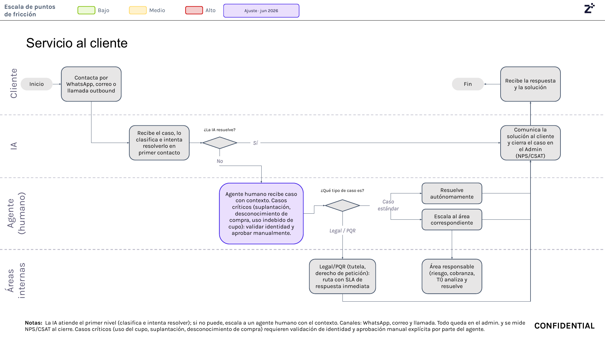

# 6. Servicio al cliente

## Objetivo

Gestionar las solicitudes, consultas, incidentes y reclamaciones de los clientes mediante un proceso de atención que prioriza la resolución en el primer contacto a través de inteligencia artificial y, cuando es necesario, escala el caso a un agente humano o al área especializada correspondiente.

---

## Journey

**Figura 11. Journey de Servicio al Cliente.**

El journey se organiza en cuatro carriles (swimlanes): **Cliente**, **IA**, **Agente (humano)** y **Áreas internas**. La caja "Agente humano recibe caso con contexto..." está marcada como ajuste de junio de 2026.

*Los elementos marcados con asterisco (\*) corresponden a puntos aún no definidos técnicamente o pendientes de confirmación con el dueño del proceso; se detallan en cada paso y se listan de forma consolidada en "Pendientes de validación".*

---

## Descripción general

Cuando un cliente necesita soporte puede comunicarse mediante WhatsApp, correo electrónico o llamada\* (el diagrama la señala específicamente como "llamada outbound"). Inicialmente el caso es atendido por un asistente basado en inteligencia artificial, encargado de clasificar la solicitud e intentar resolverla durante el primer contacto.

Si la IA no logra resolver el caso, este se transfiere a un agente humano junto con todo el contexto recopilado. El journey identifica explícitamente tres casos críticos —suplantación de identidad, desconocimiento de compra y uso indebido del cupo— para los cuales el agente debe validar la identidad del cliente y aprobar manualmente antes de continuar. Dependiendo de la naturaleza de la solicitud, el agente puede resolverla directamente o escalarla hacia las áreas responsables (Riesgo, Cobranza, Tecnología) o hacia el flujo Legal/PQR. Una vez solucionado el requerimiento, el caso se registra como cerrado en el sistema administrativo, se miden las métricas de satisfacción (NPS/CSAT) y el cliente recibe la respuesta correspondiente.

---

## Explicación paso a paso

Cada paso incluye el **proceso** (qué ocurre técnica u operativamente) y un **tiempo estimado** de referencia, pendiente de validar con Producto/Operaciones.

### 1. Contacto inicial del cliente

**Actor:** Cliente.

**Sistemas involucrados:** Canales de atención (WhatsApp, correo, llamada); portal administrativo.

**Información utilizada:** Datos del cliente, canal de contacto, motivo de la solicitud.

**Proceso:** El cliente se comunica con el servicio de atención mediante WhatsApp, correo electrónico o llamada. El sistema registra automáticamente la solicitud y genera un caso en el portal administrativo.

**Resultado:** Caso creado; el flujo continúa hacia la clasificación automática por IA.

**Tiempo estimado:** Instantáneo (creación automática del caso al recibir el contacto).

**Placeholder\*:** el journey rotula este canal como "llamada **outbound**", lo cual sugiere que, además de que el cliente llame, el servicio también puede iniciar llamadas salientes hacia el cliente (por ejemplo, seguimiento proactivo). No está confirmado en qué escenarios se origina una llamada outbound ni cómo se relaciona con los seguimientos proactivos ya descritos en otros procesos (p. ej. seguimiento de primera compra en Captación Comercial, o gestión telefónica en Cobranza). El proceso de Cobranza ya tipifica este componente como "Resolution Call — Outbound", separado de "Inbound", lo que confirma que el canal existe operativamente y que lo pendiente es su coordinación entre áreas, no su definición.

---

### 2. Clasificación y atención mediante IA *

**Actor:** Inteligencia Artificial.

**Sistemas involucrados:** Motor de IA, base de conocimiento, portal administrativo.

**Información utilizada:** Historial del cliente, clasificación del caso, reglas de atención.

**Proceso:** La IA recibe el caso, lo clasifica según su tipo y consulta el contexto disponible del cliente (historial, casos previos) para intentar resolverlo en el primer contacto.

**Decisión:** ¿La IA resuelve el caso?

- **Sí:** la IA genera la respuesta y el caso continúa hacia el cierre.
- **No:** el caso se escala automáticamente a un agente humano junto con todo el contexto recopilado.

**Resultado:** Caso resuelto por IA, o escalado con contexto completo.

**Tiempo estimado:** Segundos (procesamiento automático de clasificación y generación de respuesta).
*
**Placeholder\*:** no está definido el criterio exacto ni el umbral de confianza que usa la IA para decidir si "resuelve" o no un caso, ni el conjunto de tipos de solicitud que tiene permitido resolver de forma autónoma. La taxonomía de motivos de contacto ya usada en Cobranza (consultas de estado de cuenta, información del crédito, beneficios del producto) es un punto de partida razonable para acotar ese conjunto.

---

### 3. Recepción del caso por el agente humano

**Actor:** Agente humano.

**Sistemas involucrados:** Portal administrativo.

**Información utilizada:** Historial del caso, conversación previa con la IA, datos del cliente, resultado de la validación de identidad.

**Proceso:** El agente humano recibe el caso con todo el contexto recopilado durante la atención de la IA. El journey identifica especialmente tres casos críticos —suplantación de identidad, desconocimiento de compra y uso indebido del cupo— para los cuales el agente debe validar la identidad del cliente antes de aprobar cualquier gestión.

**Resultado:** El agente cuenta con el contexto necesario para determinar el tipo de caso y el tratamiento a seguir.

**Tiempo estimado:** Depende de la disponibilidad del agente (asíncrono; no es instantáneo como la atención de IA).

**Placeholder\*:** no está definido el mecanismo específico de validación de identidad que debe usar el agente para los casos críticos (¿el mismo proveedor biométrico Olimpia del onboarding, u otro método?), ni el SLA de primera respuesta del agente humano tras el escalamiento. Tampoco está confirmado si el "portal administrativo" de Servicio al Cliente es el mismo sistema que el "CRM" mencionado en el proceso de Cobranza, o si son sistemas distintos que requieren integración.

---

### 4. Clasificación del tipo de caso

**Actor:** Agente humano.

**Proceso:** El agente revisa la información disponible e identifica la naturaleza del requerimiento entre tres escenarios posibles:

- **Caso estándar:** solicitudes operativas que el agente puede resolver directamente.
- **Caso especializado:** requiere intervención técnica o funcional; se escala hacia Riesgo, Cobranza o Tecnología (TI), áreas que analizan el caso y generan la solución.
- **Caso Legal o PQR:** tutela, derecho de petición o PQR; se dirige al proceso Legal/PQR, administrado bajo los tiempos de respuesta (SLA)\* definidos por la organización.

**Resultado:** Caso clasificado y enrutado hacia su tratamiento correspondiente.

**Tiempo estimado:** Segundos a minutos (clasificación manual por el agente).

**Placeholder\*:** los SLA específicos del flujo Legal/PQR (tiempos exactos de respuesta según tipo de solicitud) no están definidos en el journey; deben confirmarse con el área Legal/PQR de la organización. Tampoco está definido el punto de entrada exacto cuando un caso se escala hacia Cobranza: el proceso de cartera tiene una cadena propia (Analista de Cartera → Líder de Cartera → Comercial → Representante Jurídico → Comité Legal) y debe precisarse en qué punto de esa cadena entra un caso proveniente de Servicio al Cliente. De igual forma, "uso indebido del cupo" debe definirse con precisión frente a las categorías ya tipificadas en Cobranza (que hoy distinguen entre quejas de uso del cupo y casos de fraude), para que ambos procesos usen el mismo criterio de clasificación.

---

### 5. Resolución del caso

**Actor:** Agente humano / Área especializada.

**Proceso:** Una vez resuelto el requerimiento —ya sea directamente por el agente o por el área especializada (Riesgo, Cobranza, Tecnología, Legal/PQR)—, la solución se registra en el sistema administrativo. Se comunica la respuesta al cliente y se realiza el cierre formal del caso, registrando en ese momento las métricas de satisfacción (NPS/CSAT).

**Resultado:** Caso cerrado; cliente informado; registro administrativo actualizado; métricas NPS/CSAT registradas.

**Tiempo estimado:** Variable según el tipo de caso (estándar: minutos a horas; especializado o Legal/PQR: horas a días, sujeto a SLA).

**Placeholder\*:** no está definido el mecanismo exacto de captura de NPS/CSAT (¿encuesta automática por el mismo canal de contacto?, ¿inmediatamente al cierre o en un momento posterior?). Este componente no tiene precedente en los demás procesos ya documentados (Comercial, Cobranza), por lo que debe definirse sin un estándar previo del cual partir.

---

### 6. Recepción de la solución por el cliente

**Actor:** Cliente.

**Proceso:** El cliente recibe la respuesta mediante el canal de contacto original (WhatsApp, correo o llamada), concluyendo el proceso de atención.

**Resultado:** Cliente informado; fin del proceso de servicio al cliente para ese caso.

**Tiempo estimado:** Instantáneo del lado del sistema; la recepción efectiva depende del canal y de la disponibilidad del cliente.

---

## Reglas de negocio

- Todo contacto debe registrarse como un caso dentro del portal administrativo.
- La inteligencia artificial siempre realiza el primer intento de resolución.
- Si la IA no resuelve el caso, este debe escalarse con todo el contexto disponible.
- Los casos críticos (suplantación de identidad, desconocimiento de compra, uso indebido del cupo) requieren validación de identidad y aprobación manual explícita por parte de un agente.
- Los casos Legal/PQR deben seguir el flujo especializado y cumplir los SLA establecidos.
- Todos los casos finalizados deben registrarse en el sistema administrativo.
- Al cierre del caso se registran las métricas de satisfacción (NPS/CSAT).
- Los criterios de tipificación de motivo de contacto de Servicio al Cliente deben homologarse con la tipificación ya vigente en Cobranza, para evitar que un mismo tipo de caso se registre con nombres distintos en cada área.
- Servicio al Cliente, Comercial y Cobranza deben compartir indicadores (KPIs) de contacto con el cliente, para evitar duplicidad de gestiones y vacíos de seguimiento entre áreas.

---

## Entradas

- Solicitud del cliente.
- Canal de atención (WhatsApp, correo o llamada, incluyendo llamada outbound).
- Historial del cliente.
- Información del caso.
- Base de conocimiento para IA.
- Resultado de la validación de identidad (para casos críticos).

---

## Salidas

- Caso resuelto.
- Cliente notificado.
- Caso cerrado en el portal administrativo.
- Registro de métricas NPS/CSAT.
- Escalamiento al área correspondiente cuando aplique.

---

## Excepciones

- La IA no logra resolver el caso.
- Se detecta un caso crítico que requiere validación manual.
- El caso corresponde a un proceso Legal/PQR.
- El requerimiento debe ser atendido por Riesgo, Cobranza o Tecnología.
- Se requiere seguimiento adicional antes del cierre definitivo.
- No se logra validar la identidad del cliente en un caso crítico.

---

## Consideraciones

- El modelo combina atención automatizada (IA) con intervención humana escalonada, priorizando siempre la resolución en el primer contacto.
- Los casos críticos (suplantación, desconocimiento de compra, uso indebido de cupo) tienen un tratamiento diferenciado que exige validación de identidad antes de cualquier aprobación.
- El proceso se articula con otras áreas ya documentadas: Riesgo (documento 3, KYC), Cobranza (documento 8) y Tecnología, además del flujo Legal/PQR.
- La mención a "llamada outbound" sugiere una posible componente proactiva del servicio al cliente (la empresa llama al cliente), que debe articularse con los seguimientos proactivos ya descritos en Captación Comercial (documento 1) y Cobranza (documento 8) para evitar duplicidad de contactos.
- El proceso de Cobranza ya identificó como riesgo la "falta de apoyo comercial - SAC", es decir, que el cliente desconozca a Fliipa o que Fliipa no logre contactar al cliente, y propuso como control el uso de KPIs compartidos entre Comercial y Cobranza. Servicio al Cliente es un tercer punto de contacto directo con el cliente y debería incorporarse a ese mismo esquema de indicadores compartidos.
- Antes de operar en producción debe confirmarse si "portal administrativo" (Servicio al Cliente) y "CRM" (Cobranza) corresponden al mismo sistema; de no ser así, se requiere definir su integración o sincronización de casos.

---

## Pendientes de validación

> **Pendiente de validar con el dueño del proceso:**
>
> - Confirmar en qué escenarios se origina una llamada "outbound" desde el servicio al cliente y cómo se coordina con los seguimientos proactivos de Captación Comercial y Cobranza. *(placeholder — paso 1)*
> - Confirmar el criterio/umbral que usa la IA para determinar si puede resolver un caso de forma autónoma, y el conjunto de tipos de solicitud permitidos. *(placeholder — paso 2)*
> - Confirmar el mecanismo específico de validación de identidad para casos críticos y el SLA de primera respuesta del agente humano. *(placeholder — paso 3)*
> - Confirmar si "portal administrativo" y "CRM" son el mismo sistema o requieren integración. *(placeholder — paso 3)*
> - Confirmar los SLA específicos del flujo Legal/PQR según el tipo de solicitud. *(placeholder — paso 4)*
> - Definir con precisión qué constituye "uso indebido del cupo" y homologarlo con las categorías ya tipificadas en Cobranza. *(placeholder — paso 4)*
> - Especificar el punto de entrada exacto en la cadena de escalamiento de Cobranza cuando Servicio al Cliente traslada un caso a esa área. *(placeholder — paso 4)*
> - Confirmar el mecanismo y momento de captura de las métricas NPS/CSAT. *(placeholder — paso 5)*
> - Evaluar si Servicio al Cliente debe incorporarse al esquema de KPIs compartidos entre Comercial y Cobranza. *(placeholder — consideraciones)*

---

## Fuentes consultadas

- *Journeys Colpatria B2B* (junio de 2026), página 9.
- Documento de Alcance del Producto.
- Modelo y gestión de cobranza (Proceso Collections B2B, sumz.co).
- Modelo de Cobranza B2B (Proceso Collections B2B, sumz.co).
- Tipificación de motivos de contacto (Proceso Collections B2B, sumz.co).
- Investigación B2B — Recaudo Fliipa + D1 (Proceso Collections B2B, sumz.co).
- Modelo Comercial B2B (Proceso Collections B2B, sumz.co).
